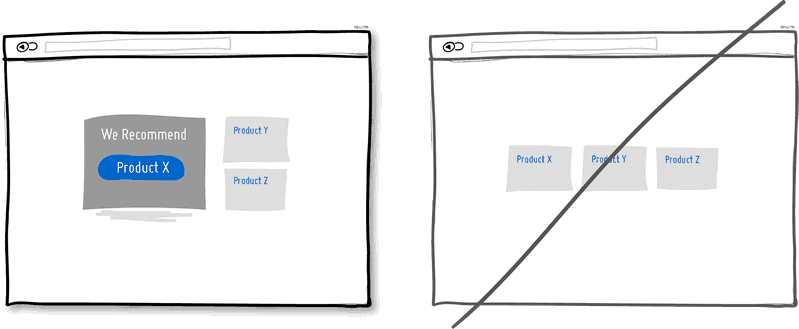

# A Good User Interface
has high conversion rates and is easy to use.

In other words, it's nice to both the business side as well as the people using it.
Here is a running idea list which we're <a href="http://www.goodui.org/evidence">actively testing</a> and <a href="http://www.goodui.org/datastories">writing exclusive stories about</a>.

We still have a long way to go.
We continue to learn about what makes user interfaces better by trying these ideas out in various combinations on <a href="http://www.linowski.ca">real optimization projects</a>.
At the same time, our amazing clients allow us to share detailed <a href="http://www.goodui.org/datastories">optimization stories</a> for you to learn from.
In the long run, our goal is to build out a <a href="http://www.goodui.org/evidence">repository of evidence</a> showing clearly which ideas work better and which ones less so.
We hope this will make life easier for others.
Oh and we also <a href="https://www.goodui.org/blog">blog about optimization</a> here and there.
Here we go ...

## 1 Try A One Column Layout instead of multicolumns.
A one column layout will give you more control over your narrative. It should be able to guide your readers in a more predictable way from top to bottom. Whereas a multi column approach runs some additional risk of being distracting to the core purpose of a page. Guide people with a story and a prominent call to action at the end.

## 2 Try Giving a Gift instead of closing a sale right away.
A friendly gesture such as providing a customer with a gift can be just that. Deeper underneath however, gifting is also an effective persuasion tactic that is based on the rule of reciprocity. As obvious as it sounds, being nice to someone by offering a small token of appreciation can come back in your favour down the road.

## 3 Try Merging Similar Functions instead of fragmenting the UI.
Over the course of time, it's easy to unintentionally create multiple sections, elements and features which all perform the same function. It's basic entropy - things start falling apart over time. Keep an eye out for duplicate functionality labelled in various ways, as it puts a strain on your customers. Often, the more UI fragmentation there is, the higher the learning curve which your customers will have to deal with. Consider refactoring your UI once in a while by merging similar functions together.

## 4 Try Social Proof instead of talking about yourself.
<a href="http://www.goodui.org/evidence/?4">Evidence Exists For A +3% Effect From This Idea</a> 
Social proof is another great persuasion tactic directly applicable to increasing conversion rates. Seeing that others are endorsing you and talking about your offering, can be a great way to reinforce a call to action. Try a testimonial or showing data which proves that others are present.

## 5 Try Repetition instead of showing it just once.
<a href="http://www.goodui.org/evidence/?5">Evidence Exists For A +84% Effect From This Idea</a> 
Repeating your call to action is a strategy that is more applicable to longer pages, or repeating across numerous pages. Surely you don't want to have your offer displayed 10 times all on the same screen and frustrate people. However, long pages are becoming the norm and the idea of squeezing everything "above the fold" is fading. It doesn't hurt to have one soft actionable item at the top, and another prominent one at the bottom. When people reach the bottom, they pause and think what to do next - a potential solid place to make an offer or close a deal.

## 6 Try Distinct Clickable/Selected Styles instead of blurring them.

Visual styling such as color, depth, and contrast may be used as a reliable cue to help people understand the fundamental language of navigating your interface: where am I, and where can I go. In order to communicate this clearly to your users, the styles of your clickable actions (links, buttons), selected elements (chosen items), and plain text should be clearly distinct from one another and then applied consistently across an interface. In the visual example, I've chosen a blue color to suggest anything that can be clicked on, and black as anything that has been selected or indicates where someone is. When applied properly, people will more easily learn and use these cues to navigate your interface. Don't make it harder for people by blurring these three functional styles.

## 7 Try Recommending instead of showing equal choices.
<a href="http://www.goodui.org/evidence/?7">Evidence Exists For A +14% Effect From This Idea</a> 
When showing multiple offers, then an emphasized product suggestion might be a good idea as some people need a little nudge. I believe there are some <a href="http://www.nytimes.com/2010/02/27/your-money/27shortcuts.html?_r=0" alt="Too Many Choices: A Problem That Can Paralyze">psychology studies</a> out there which suggest that the more choice there is, then the lower the chances of a decision actually being made and acted upon. In order to combat such analysis paralysis, try emphasizing and highlighting certain options above others.

## 8 Try Undos instead of prompting for confirmation.
Imagine that you just pressed an action button or link. Undos respect the initial human intent by allowing the action to happen smoothly first and foremost. Prompts on the other hand suggest to the user that he or she does not know what they are doing by questioning their intent at all times.

I would assume that most of the time human actions are intended and only in small situations are they accidental. The inefficiency and ugliness of prompts is visible when users have to perform actions repeatedly and are prompted numerously over and over - a dehumanizing experience. Consider making your users feel more in control by enabling the ability to undo actions and not asking for confirmation where possible.

## 9 Try Telling Who It's For instead of targeting everyone.
Are you targeting everyone or are you precise with your audience? This is a conversion idea where you could be explicit about who exactly your product or service is intended for. By communicating the qualifying criteria of your customers, you might be able to actually connect more with them while at the same time hinting at a feeling of exclusivity. The risk with this strategy of course is that you might be cutting yourself short and restricting potential customers. Then again, transparency builds trust.

 (<i>Side note: Enjoying the little characters style? Please be sure to check out <a href="http://www.linowski.ca/micropersonas">MicroPersonas</a></i>.)

## 10 Try Being Direct instead of indecisive.
You can send your message with uncertainty trembling in your voice, or you can say it with confidence. If you're ending your messaging with question marks, using terms such as "perhaps", "maybe", "interested?" and "want to?", then most likely you have some opportunity to be a bit more authoritative. Who knows, maybe there is a bit more room for telling people what to do next in the world of conversion optimization.

## 11 Try More Contrast instead of similarity.

Making your calls to action be a bit more prominent and distinguishable in relation to the elements surrounding them, will make your UI stronger. You can easily increase the contrast of your primary calls to action in a number of ways. Using tone, you can make certain elements appear darker vs. lighter. With depth, you can make an item appear closer while the rest of the content looks like it's further (talking drop shadows and gradients here). Finally, you can also pick complementary colors from the color wheel (ex: yellow and violet) to raise contrast even further. Taken together, a higher contrast between your call to action and the rest of the page should be considered.

## 12 Try Personality instead of being generic.
<a href="http://www.goodui.org/evidence/?12">Evidence Exists For A -2.1% Effect From This Idea</a> 
Introducing yourself or your product with a name, picture or place of origin is one way to make your communication more personal. Mentioning the country, state or city of origin is surely a very human like beginning. Even if you do so virtually then you just might be perceived as a bit more friendly. Often, stating where your product is being made at also has a pretty good chance of making it feel of slightly higher quality. It's a win win.

## 13 Try Fewer Form Fields instead of asking for too many.

<a href="http://www.goodui.org/evidence/?13">Evidence Exists For A +7.6% Effect From This Idea</a> 
Human beings are inherently resistant to labor intensive tasks and this same idea also applies to filling out form fields. Each field you ask for runs the risk of making your visitors turn around and give up. Not everyone types at the same speed, while typing on mobile devices is still a chore in general. Question if each field is really necessary and remove as many fields as possible. If you really have numerous optional fields, then also consider moving them after form submission on a separate page or state. It's so easy to bloat up your forms, yet fewer fields will convert better.

## 14 Try Exposing Options instead of hiding them.

<a href="http://www.goodui.org/evidence/?14">Evidence Exists For A +50.8% Effect From This Idea</a> 
Each pull down menu that you use, hides a set of actions within which require effort to be discovered. If those hidden options are central along the path to getting things done by your visitors, then you might wish to consider surfacing them a bit more up front. Try to reserve pull down menus for options that are predictable and don’t require new learning as in sets of date and time references (ex: calendars) or geographic sets. Occasionally pull down menu items can also work for those interfaces that are highly recurring in terms of use - actions that a person will use repeatedly over time (ex: action menus). Be careful of using drop downs for primary items that are on your path to conversion.

## 15 Try Suggesting Continuity instead of false bottoms.
A false bottom is a conversion killer. Yes, scrolling long pages are great, but be careful of giving your visitors a sense that the page has come to an end somewhere in between sections where it really hasn't. If your pages will scroll, try to establish a visual pattern or rhythm that the user can learn and rely on to read further down. Secondarily, be careful of big gaps in around the areas of where the fold can appear (of course I’m referring to a area range here with so many device sizes out there).

## 16 Try Keeping Focus instead of drowning with links.

<a href="http://www.goodui.org/evidence/?16">Evidence Exists For A +5.6% Effect From This Idea</a> 
It’s easy to create a page with lots of links going left and right in the hope of meeting as many customer needs as possible. If however you’re creating a narrative page which is building on towards a specific call to action at the bottom, then think twice. Be aware that any link above the primary CTA runs the risk of taking your customers away from what you’ve been hoping them to do. Keep an eye out on the number of links on your pages and possibly balance discovery style pages (a bit heavier on the links) with tunnel style pages (with fewer links and higher conversions). Removing extraneous links can be a sure way to increase someone’s chances of reaching that important button.

## 17 Try Showing State instead of being state agnostic.
In any user interface we quite often show elements which can have different states. Emails can be read or unread, invoices can be paid or not, etc. Informing users about the particular state in which an item is in, is a good way of providing feedback. Interface states can help people understand whether or not their past actions have been successfully carried out, as well as whether an action should be taken.

## 18 Try Benefit Buttons instead of just task based ones.
<a href="http://www.goodui.org/evidence/?18">Evidence Exists For A -8.3% Effect From This Idea</a> 
Imagine two simple buttons displayed on a page. One button tells you that it will “Save You Money”, while the other one asks you to “Sign Up”. I’d place my bets that the first one might have a higher chance of being acted on, as a sign up on it’s own has no inherent value. Instead, a sign up process takes effort and is often associated with lengthy forms of some sort. The hypothesis set here is that buttons which reinforce a benefit might lead to higher conversions. Alternatively, the benefit can also be placed closely to where the action button is in order to remind people why they are about to take that action. Surely, there is still room for task based actions buttons, but those can be reserved for interface areas that require less convincing and are more recurring in use.

## 19 Try Direct Manipulation instead of contextless menus.
Occasionally it makes sense to allow certain UI elements to be acted upon directly as opposed to listing unassociated generic actions. When displaying lists of data for example, we typically want to allow the user to do something with the items in the list. Clicking on, or hovering over an item in this list can be used to express that a particular item is to be manipulated (deleted, renamed, etc.). Another example of common direct manipulation would be clicking on a data item (say a text based address) which then turns into an editable field. Enabling such interactions cuts through the number of required steps, compared to if the same task was started more generally without the context of the item - since selection is already taken care of. Do keep in mind of course that for generic item-agnostic actions, there is nothing wrong with contextless menus.

## 20 Try Exposing Fields instead of creating extra pages.
<a href="http://www.goodui.org/evidence/?20">Evidence Exists For A -0.2% Effect From This Idea</a> 
When creating landing pages that convey value, it can be beneficial to show the actual form fields on the conversion page itself.  Merging the sign up form with the landing page comes with a number of benefits in comparison to creating separate multi-page sign ups. First, we are cutting out extra steps from the flow in general and the task at hand takes less time. Secondly, by showing the number of form fields right there, we are also providing the customer with a sense of how long the sign up actually is. This of course is a little easier when our forms are shorter in the first place (which of course they should be if possible).

## 21 Try Transitions instead of showing changes instantly.
Interface elements often appear, hide, move, shift, and resize as users do their thing. As elements respond to our interactions, it sometimes is a little easier to comprehend what just happened when we sprinkle in the element of time. A built in intentional delay in the form of an animation or transition, respects cognition and gives people the required time to understand a change in size or position. Keep in mind of course that as we start increasing the duration of such transitions beyond 0.5 seconds, there will be situations where people might start feeling the pain. For those who just wish to get things done quickly, too long of a delay of course can be a burden.

## 22 Try Gradual Engagement instead of a hasty sign up.
<a href="http://www.goodui.org/evidence/?22">Evidence Exists For A +26% Effect From This Idea</a> 
Instead of asking visitors to sign up immediately, why not ask them to first perform a task through which something of value is demonstrated. During such initial interactions the product can both show off its benefits, as well as can lend itself to personalization. Once users begin to see your product’s value and see how they can make it their own, they will then be more open to sharing with you additional information. Gradual engagement is really a way to postpone the sign up process as much as possible and still allow users to use and customize your application or product.

## 23 Try Fewer Borders instead of wasting attention.
Borders compete for attention with real content. Attention of course is a precious resource since we can only grasp so much at any given time. Surely borders can be used to define a space very clearly and precisely, but they also do cost us cognitive energy as they are perceived as explicit lines. In order to define relationships between screen elements which use less attention, elements can also be just grouped together through proximity, be aligned, have distinct backgrounds, or even just share a similar typographic style. When working in abstract UI tools, it’s easy to drop a bunch of boxes everywhere. Boxes however come with a false sense of being immune from the order and unity which governs the rest of the screen. Hence pages with lots of boxes sometimes may tend to look noisy or misaligned. Sometimes it is helpful to throw in a line here and there, but do consider alternative ways of defining visual relationships that are less taxing to attention and your content will come through.

## 24 Try Selling Benefits instead of features.
<a href="http://www.goodui.org/evidence/?24">Evidence Exists For A +4.3% Effect From This Idea</a> 
I think this is Marketing 101. People tend to care less about features than they do about benefits. Benefits carry with them more clearly defined value. Chris Guillebeau in "The $100 Startup" writes that people really care about having more of: Love, Money, Acceptance and Free Time, while at the same time wishing for less Stress, Conflict, Hassle and Uncertainty. When showing features, and I do believe that there is still room for them occasionally, be sure to tie them back to benefits where possible.

## 25 Try Designing For Zero Data instead of just data heavy cases.
There are cases when you will have 0, 1, 10, 100, or 10,000+ data results which might need to be displayed somehow in various ways. The most common of these scenarios is probably the transition from first time use with zero data towards future use with a lot more data. We often forget to design for this initial case when there is still nothing to display whatsoever, and by doing so we run the risk of neglecting users. A zero data world is a cold place. When first time users look at your app and all it does is show a blank slate without any guidance then you’re probably missing out on an opportunity. Zero data states are perfect candidates for getting users across the initial hurdle of learning by showing them what to do next. Good things scale and user interfaces are no exception.

## 26 Try Opt-Out instead of opt-in.
<a href="http://www.goodui.org/evidence/?26">Evidence Exists For A +8.1% Effect From This Idea</a> 
An opt-out strategy implies that users or customers are defaulted to take part in something without having to take any action. Alternatively, there is also the more traditional opt-in strategy that requires people to first take an action in order to take part in or receive something.

There are two good reasons why opt-out works better than opt-in. First it alleviates resistance on the path of action, as the user does not have to do anything. Secondly, it’s also a form of recommendation which implies some kind of a norm - “since everyone else takes this as it is, I might also do the same”.

Of course the opt-out strategy is often perceived as controversial as there are those sleazy marketers which will abuse it. One such evil is to diminish the readability of the opt-out text, while another is to use confusing text, such as double negatives. Both examples will result in users being less aware of actually signing up for something.

Hence to keep the ethics in check, if you do decide to go with an opt-out approach, do make it very clear and understandable to your customers what they are being defaulted into. After all, this tactic has also been used <a href="http://webs.wofford.edu/pechwj/Do%20Defaults%20Save%20Lives.pdf">in Europe to save lives</a>.

## 27 Try Consistency instead of making people relearn.
Striving for consistency in user interface design is probably one of the most well known principles since Donald Norman’s awesome books. Having a more consistent UI or interaction is simply a great way to decrease the amount of learning someone has to go through as they use an interface or product. As we press buttons and shift sliders, we learn to expect these interaction elements to look, behave and be found in the same way repeatedly. Consistency solidifies the way we learn to interact and as soon as it is taken away, we are then forced back into learning mode all over again. Consistent interfaces can be achieved through a wide possible range of things such as: colors, directions, behaviors, positioning, size, shape, labelling and language.

Before we make everything consistent however, please let’s bear in mind that keeping things inconsistent still has value. Inconsistent elements or behaviors come out into attention from the depths of our habitual subconscious - which can be a good thing when you want to have things get noticed. Try it, but know when to break it.

## 28 Try Smart Defaults instead of asking to do extra work.
<a href="http://www.goodui.org/evidence/?28">Evidence Exists For A +1.1% Effect From This Idea</a> 
Using smart defaults or pre-filling form fields with educated guesses removes the amount of work users have to do. This is a common technique for helping users move through forms faster by being respectful of their limited time. One of the worst things from an experience and conversion stand point is to ask people for data that they have already provided in the past, repeatedly over and over again. Try to display fields that are preloaded with values to be validated as opposed to asking for values to be retyped each time. The less work, the better.

## 29 Try Conventions instead of reinventing the wheel.
Convention is the big brother of consistency. If we keep things similar across an interface, people won’t have to obviously struggle as hard. If on the other hand, we all keep things as similar as possible across multiple interfaces, that decreases the learning curve even further. With the help of established UI conventions we learn to close screen windows in the upper right hand corner (more often than not), or expect a certain look from our settings icons. Of course there will be times when a convention no longer serves purpose and gives way to a newer pattern. When breaking away, do make sure it’s purposefully thought out and with good intention.

## 30 Try Loss Aversion instead of emphasizing gains.
We like to win, but we hate to lose. According to the rules of <a href="http://en.wikipedia.org/wiki/Loss_aversion" alt="Loss Aversion">persuasive psychology</a>, we are more likely to prefer avoiding losses than to acquiring gains. This can be applied to how product offerings are framed and communicated. By underlying that a product is protective of a customer’s existing well-being, wealth or social status, such strategy might be more effective than trying to provide a customer with something additional which they don’t already have. Do insurance companies sell the payout that can be gained after the accident or the protection of the things we hold dear to us?

## 31 Try Visual Hierarchy instead of dullness.
A good visual hierarchy can be used to separate out your important elements from the less important ones. A visual hierarchy results from varying such things as alignment, proximity, colour, tone, indentation, font size, element size, padding, spacing, etc. When these visual language elements are applied correctly, they can work together to direct and pause people’s attention within a page - improving general readability.

A visual hierarchy can be said to generate friction and slows us down from skimming through the full page top to bottom - for the better that is. With a good visual hierarchy, although we might spend a bit more time on the page, the end result should be that we register more items and characteristics. Think of it as as road trip. You can take the highway and get to your destination quicker (bottom of page), or you can take the scenic route and remember more interesting things along the way. Give the eye a place to stop.

## 32 Try Grouping Related Items instead of disordering.
Grouping related items together is a basic way of increasing fundamental usability. Most of us tend to know that a knife and a fork, or open and save functions can typically be found more or less together. Related items are just meant to be placed in proximity of each other in order to respect a degree of logic and lower overall cognitive friction. Wasting time looking for stuff usually isn't fun for people.

## 33 Try Inline Validation instead of delaying errors.
When dealing with forms and errors, it’s usually better to try to detect if something isn’t correct and show it sooner rather than later. The famous interaction pattern highlighted here of course is inline validation. By showing an error message as it happens (say to the right of the input field), it can be corrected right then and there as it appears in context. On the other hand, when error messages are displayed later on (say after a submit), it forces people to do some additional cognitive work of having to recall what they were doing from a few steps back.

## 34 Try Forgiving Inputs instead of being strict with data.
Being more forgiving in terms of user entered data, computers can move one step closer towards becoming a bit more humane. Forgiving inputs anticipates and understands a variety of data formats and thereby makes your UI more friendly. A perfect example of this is when we ask people for a phone number which can be entered in so many different ways - with brackets, extensions, dashes, area codes, and on. Have your code work a bit harder so that your users won’t have to.

## 35 Try Urgency instead of timelessness.
<a href="http://premium.docstoc.com/c/58/ch/358/l/1553/Create-Urgency">Urgency</a> is a persuasion tactic which can be applied in order to make people act now rather than later (or possibly never). It works because it often implies some degree of scarcity, as the thing which is available now might not be available tomorrow. It also works because it touches upon loss aversion in the same way - as we don’t like losing out on opportunities. Urgency might also be one of those strategies that some look down upon as a pushy and dirty way of getting people to act. Nevertheless it’s available as a strategy to use and as long as it’s honest it’s valid. Be careful of creating a false sense of urgency, since when your audience calls you on it, it will backfire.

## 36 Try Scarcity instead of abundance.
When there is less of anything, we tend to value it more. Scarcity suggests there was once more of something, today there is less of it, and tomorrow it might shrink yet even further. Think of a wholesale store vs. a boutique one and then look at how their pricing often compares. Then think back to the wholesaler and notice one scarcity strategy that they apply nevertheless, in light of having a wider product offering. Some wholesalers or mega retailers will actually do limited products that are only available until they are bought out, without replenishing the supply. In software, we often forget about scarcity because more often than not, bits and bytes can be so easily duplicated and there is so much abundance with the help of copy-paste. Nevertheless, in the world of UI, scarcity can still be used to show limits or bottlenecks that relate to the real world. Think of the limits behind the number of tickets you can sell to a webinar, the number of clients you can service in a month, or the number physical products you might have before the next batch is produced. All these things can be shown to the user to evoke action while being more informed. Think supply and demand. Think less is more.

## 37 Try Recognition instead of recall.
<a href="http://www.goodui.org/evidence/?37">Evidence Exists For A +10% Effect From This Idea</a> 
This is a classic principle of design tied strongly to psychology which suggests that it is easier to recognize something existing, as opposed to having to recall it purely from one’s own memory. Recognition relies on some kind of cues or hints which help us by touching our past experience. Recall requires us to probe the depths of our memory all on our own. This might be the reason why sometimes multiple choice questions on exams can be faster to complete than open ended ones. Consider giving users the ability to recognize items which they have been exposed to before, instead of expecting them to remember everything on their own.

## 38 Try Bigger Click Areas instead of tiny ones.
Links, forms and buttons can all be made easier to click on if their size is increased. According to <a href="http://en.wikipedia.org/wiki/Fitts%27s_law">Fitt’s Law</a>, we need more time to click on something with a pointing device, the further away it is and/or smaller it is. For this very reason, do consider increasing your form fields, calls to action, and links. Alternatively, it's also possible to keep the visual element looking as is, but instead only increasing its hotspot or clickable area. A popular example of this are text links on mobile devices or within navigation menus, that are stretched with padding.

## 39 Try Faster Load Times instead of making people wait.
Speed matters. Be it how quickly a screen loads initially, or how fast it responds to a user action can both affect whether people will wait or not. It has been suggested that <a href="http://www.webperformancetoday.com/2010/07/01/the-best-graphs-of-velocity/">each second longer</a> affects drop off, bounce and conversion rates.

Hence one tactic is to decrease the load times of our screens technically by optimizing code and images. Another tactic is to decrease the perception of load times by applying some psychology. Two tricks can be applied in order to make people feel like they aren't waiting for so long. Showing progress bars which set expectations is one. Keeping users occupied while something is loading, is another (think walking to the conveyor belt a bit longer instead of standing beside it and tapping your foot).

## 40 Try Keyboard Shortcuts instead of buttons only.
When you have a high use product, it’s always good to consider those advanced users who keep coming back and spend much time with your application. People will often seek ways which allow them to perform repetitive task quicker and keyboard shortcuts are one such way of providing this. Hot keys, once remembered, can speed up task performance over point and click graphical user interfaces dramatically. One example of this is the use of the <a href="http://www.skipser.com/p/2/p/why-google-uses-j-and-k-keys.html">J and K hot keys</a> for next and previous which have been popularize by applications such as Gmail, Google Reader (now history), Twitter and Tumblr. Buttons aren’t bad, but they can be complemented with shortcuts for those fast fingers.

## 41 Try Anchoring instead of starting with the price.
<a href="http://www.goodui.org/evidence/?41">Evidence Exists For A +8.8% Effect From This Idea</a> 
Humans come loaded with cognitive biases, and as <a href="http://en.wikipedia.org/wiki/Anchoring">Kahneman observed</a>, anchoring is one such bias that is hard to resist. It suggests that our decision making is affected by the first quantities which come to our attention. When we start with a larger number and roll down towards a smaller price, all of a sudden that price doesn't feel as large any longer. If I understand correctly, what many people miss however, is that the anchored number also doesn't have to be a price. It can be a number which doesn't need a dollar value. A common example of marketers exploiting the anchoring effect is showing the Manufacturer's Suggested Retail Price followed by a lower price.

## 42 Try Upfront Progress instead of starting with a blank.
There is more motivation for getting things done the closer we are to completion. For this reason, some companies give away prestamped coffee cards. Or in the virtual world, others reward the signup process as a completed item on the list of things to do. Stephen Anderson labeled this similar pattern as <a href="http://getmentalnotes.com/cards/set_completion">Set Completion</a> in his Mental Notes, while more formally, it can be also referred to as the <a href="http://coglode.com/gems/goal-gradient-effect">Goal Gradient Effect</a>. Either way, do make people progress or feel like they are progressing sooner rather than later.

## 43 Try Progressive Disclosure instead of overwhelming.
<a href="http://www.goodui.org/evidence/?43">Evidence Exists For A -0.1% Effect From This Idea</a> 
<a href="http://en.wikipedia.org/wiki/Progressive_disclosure">Progressive Disclosure</a> protects the user from too much irrelevant information. It's a pattern which only shows information gradually if it makes sense to do so - often in the context of forms. Typically, progressive disclosure's gradual unveiling is also accompanied by some form of <i>inline expansion</i> or slide out animation. If too many fields increase effort and scare people away, then this is another tactic of avoiding having to enter unnecessary fields. Only show/ask for what is relevant to the situation at hand.

## 44 Try Smaller Commitments instead of one big one.
<a href="http://www.goodui.org/evidence/?44">Evidence Exists For A +9.4% Effect From This Idea</a> 
Ask people to start off with a smaller upfront commitment followed by some larger ones down the road. Big commitments can scare people off. Borrowing from <a href="http://en.wikipedia.org/wiki/Robert_Cialdini">Robert Cialdini’s</a> work, using commitment is a powerful persuasion strategy which taps into people’s desire to be seen as having a consistent self image. That quest for consistency suggests that generally people can climb a series of smaller and connected actions more easily than one larger one. An application stemming from this is known as the <a href="http://en.wikipedia.org/wiki/Foot-in-the-door_technique">foot in the door technique</a> which works by “getting a small 'yes' and then getting an even bigger 'yes.'”. One example of this would be a dating site that is asking people to just look around, followed by an introduction task, followed by a couple ideas for a date, etc. This is opposite of course to asking the same users to lock into a marriage right away (nothing wrong with getting married). :) In the context of pricing, another example can be seen when we ask customers to pay a series of monthly fees instead of an annual one. A related tactic of lowering upfront commitment might also show a “no contract” messaging in order to make customers feel that they can leave anytime which further decreases the barrier to entry.

## 45 Try Softer Prompts instead of modal windows.
The modal window or dialog box is an attention hog, like it or not. Grabbing someone’s attention can be a good thing, but modal windows often come with <a href="http://www.azarask.in/blog/post/designing-without-modal-overlays/">some nasty problems</a>. First of all, modal windows can block users from performing other functions or referencing information from behind the modal. They can also be difficult to get out of for some users. Dialog boxes are also at fault for often halting the computer from completing given work which can be irritating if the user is away. Finally, modals may frustrate with interruption if someone is deep in their task and not ready to take other actions. Why not consider more subtle inline or slide out methods which might be less obtrusive and can equally capture people’s attention?

## 46 Try Multifunctional Controls instead of more parts.
Simplicity is often valued in design as it somewhat correlates with ease of use. Too much clutter may burn through our limited attention pools and the more parts there are, the more room for usability issues to creep up. One way for the user interface to achieve the same with less is to make UI controls more multifunctional. That is, you take one control and you squeeze two or more functions into it. As one example, we can combine a search input field with a filtering mechanism that affects a list below right as you type. This removes the need for additional filters. We can also combine a ranking display with a rating onhover function to further avoid additional parts.

Multifunctionalism isn’t all that golden though. Although it simplifies, it does so at the cost of discoverability. Functions which are less visible up front run the risk of not being found. It’s therefore probably better to reserve the multifunctional approach for repeat visitors which can deal with a slightly higher learning curve. Also, use it wisely and <a href="http://www.firebox.com/product/1861/Wenger-Giant-Swiss-Army-Knife">don’t over do it</a>.

## 47 Try Icon Labels instead of opening for interpretation.
<a href="http://www.goodui.org/evidence/?47">Evidence Exists For A +13% Effect From This Idea</a> 
Icons can be wide open to interpretation and combining them with words can remove some of the ambiguity. Take a down arrow icon for example. Does it mean to move something down, lower its priority, or download? Or does an “x” icon mean to delete, disable, or close? The problem becomes larger for light use interfaces where there isn’t much time for the person to learn the meaning of the icons. To make the icons more understandable, they can be augmented with textual labels. If space is truly an issue, some user interfaces compromise by showing all of their icon labels on a single hover (less painful than having to hover on each individual icon).

## 48 Try Natural Language instead of dry text.
<a href="http://www.goodui.org/evidence/?48">Evidence Exists For A +3.3% Effect From This Idea</a> 
<a href="http://en.wikipedia.org/wiki/Natural_language_user_interface">Natural language</a> is a more informal and conversational interaction style than just short, strict and formal words. This style is often associated with computers being able to understand (or seem like they understand) humans better, forgive where necessary, and vice versa.  The expectation is two fold. First, a person types in a phrase which the computer would ideally comprehend the full meaning of. Second, the responses by the computer are also more conversational and friendly in return. Although we might not be fully there yet with the first part, there are some basic and promising examples such as: searching for “toronto weather” in Google, Ubiquity for Firefox and Siri commands. As for interfaces which display their messages as conversations there are some hints that they might <a href="http://www.jroehm.com/2014/01/ui-pattern-natural-language-form/">convert just a bit better</a> (some more testing required).

## 49 Try Curiosity instead of being reserved.
<a href="http://www.goodui.org/evidence/?49">Evidence Exists For A +21% Effect From This Idea</a> 
Stirring curiosity is a conversion tactic which tries to drive up desire for something by providing a bit of teasing information. It could be a sample chapter, a demo, a trial, or some free genuine content which leads up to a call to action sounding like “in order to see the rest, do XYZ”. Teasing your users, customers and/or leads with samples and hooks is a good way for people to want to continue on the path of action. As obvious as it sounds, another sure shot way to fail at stirring curiosity (aside of not having it at all in the first place) is of course by providing the complete range of information or offering upfront. Perhaps giving people a full trial, or all of X out of Y before they are customers, isn’t the best way to motivate them. Keep them hungry for more - at least for a bit. :)

## 50 Try Reassurances instead of assuming all is fine.
<a href="http://www.goodui.org/evidence/?50">Evidence Exists For A -7% Effect From This Idea</a> 
When you’re closing a sale, drop some reassurances. Throw in a guarantee, tell your customers that they will be satisfied, tell them that the payment is secure, that yes shipping is free, and yes that they can pull out at anytime without any risk. All is good and all will be fine. Don't worry, be happy. Putting a positive spin on a close is definitely worth a try as a conversion tactic.

## 51 Try Price Illusions instead of just plain prices.
You can let people judge the value of your product completely on their own, or you can help to do it for them. If you decide to make use of human irrationality, you can show the price in a way so that your offering becomes perceived as more valuable. In the simplest way you can start off with framing words such as "only", "affordable", or "small fee of" alongside of the price. The price then can also be broken down into a per unit price (ex: 30¢ per page rather than $30 for a book, or $1 per day instead of $30 per month for a membership). Further, the infamous prices ending in a "9" instead of having a round number can also be used. Finally, prices can be shown with fewer digits ($30, instead of $30.00) for an additional effect of illusion.

## 52 Try Thanking instead of simply confirming completion.
<a href="http://www.goodui.org/evidence/?52">Evidence Exists For A +0% Effect From This Idea</a> 
Thanking people can make you, your business, product or UI feel more human as it shows you're appreciative and you care. Thanking of course happens during some sort of task completion and is bigger than just plain feedback. More so, making your UI thankful can be used as a way to induce further dialogue or action. So naturally, thank you screens are a perfect spot to suggest the next optional action for the customer or user to take. Thanks for reading this paragraph. :)

## 53 Try Useful Calculations instead of asking to do math.
A user interface can do mathematical calculations, large or small, for users and thus remove unnecessary friction. As one example, let's say that some application shows used up credits out of an available pool. It might be more meaningful to calculate for users how many remaining days that actually is before their application stops functioning. Or yet an even simpler and more popular example when we try to understand how recent or old multiple rows of data really are. In this case a relative time stamp of "3 min ago" has more meaning and requires less effort to comprehend than say an absolute one of "4:37pm, Sept 2". Take out the pain of having to do the math.

## 54 Try Reaffirming Freedom instead of implying it.
People may be persuaded to act more often when their choice or free will is explicitly reaffirmed. There have been <a href="http://www.spring.org.uk/2013/02/the-one-really-easy-persuasion-technique-everyone-should-know.php">some studies</a> done on the "<a href="http://www.tandfonline.com/doi/abs/10.1080/10510974.2012.727941#.VD68jRZmqpc">But You Are Free</a>" technique with cases where the effect to act sometimes even doubled. The idea is to call out an action or decision, followed by a simple statement suggesting that "it's your choice", or "you are free to refuse", etc. The persuasive power of this technique seemed the strongest when the request was made face-to-face and/or the request to act and reaffirmation were closer together.

## 55 Try Variable Rewards instead of predictability.
Variable rewards are great way to <a href="http://www.nirandfar.com/2012/03/want-to-hook-your-users-drive-them-crazy.html">get users hooked</a>. When we (or mice at least) press levers that spit out pellets unpredictably (as in sometimes not spitting out anything), then such a schedule of reinforcement has the <a href="http://en.wikipedia.org/wiki/Reinforcement#Schedules">highest rate of response</a> in the shortest amount of time. If eating pellets isn't your thing however, then please consider how addictive email checking can be as we never really know when those "rewarding ones" really do appear (assuming you receive more than just the same old email from Joe everyday).

## 56 Try Attention Grabs instead of neglect.
<a href="http://www.goodui.org/evidence/?56">Evidence Exists For A +29.7% Effect From This Idea</a> 
It's worth channelling additional attention towards the most important actions. This can be achieved in numerous ways starting with the more obvious size increase or higher contrast of an element. Other ways for directing attention also include: using irregular shapes, field auto focusing, section highlights, sticky element interactions (floating), as well as directional arrows. Surely you cannot have everything scream on a page, but emphasizing the primary calls to action is worth the effort.

## 57 Try Friendly Comparisons instead of confusion.
User interfaces sometimes require us to make comparisons of product characteristic which directly affects ease of use. There are a number of ways in which such comparisons can be made more understandable and therefore help users make a smoother decision.

First of all, limiting the number of things or properties to compare at any given time is one simple way of alleviating confusion.

Secondly, spacing out properties should help comparison making, instead of mixing various properties into a single column.

Thirdly, asking the user to make a single decision (instead of threaded or multiple ones at the same time) should remove additional cognitive friction.

Overall, the purpose of a table should be to show the difference of the most relevant attributes and help make a single decision.

## 58 Try Set Collections instead of independent items.
<a href="http://www.goodui.org/evidence/?58">Evidence Exists For A +160% Effect From This Idea</a> 
People are motivated to collect things.  Whether physical or virtual, seeing a closed set of things to collect from establishes a goal to strive for. Often obtaining the complete set can motivate even further by carrying added benefits of synergistic qualities (a cake is bigger and better than its individual ingredients). Perhaps, showing items which have been already collected, also reinforces behavior by showing past actions as achievement. Finally, the motivation to collect a complete set might be stronger if the number of items is known to be finite (overlaying scarcity).

## 59 Try Expectation Setting instead of being ignorant.
It's nice when people set expectations for each other. It doesn't take much effort for a person or interface to inform someone when the next task will be completed. You are on step 1 of X. Your choice will result in Y. You will receive something before Z. All those little promises not only inform but also build trust. Unhelpful interfaces on the other hand can come off a little cold as the user is kept in the dark.

## 60 Try Humor instead of being so serious.
Why should everything always have to be so serious all the time? It doesn't. You can always lighten up by throwing in a joke or something playful here and there. Adding humor to your UI might or might not work. When it does work however, humor can build up a stronger human relationship between you and your users/customers. Having an amount of such chuckles and smiles built up and stored away for the future is probably a nice to have. When the times get tough, people who have a stronger and more personal relationship with you may be more prone to forgiveness during erroneous situations.

## 61 Try Providing Feedback instead of silence.
When we perform an action or task, we want to know that it has been successfully completed. Feedback provides this closure to any action. It can be as subtle as the drying of ink on a piece of paper, or as blunt as a dialogue message confirming that one of your emails has been delivered. Silence on the other hand breeds uncertainty. Did it really work? Did I hear a click? Was the button really pressed? Should I try again? Feedback answers all these questions. It is a very valuable and essential element for any successful interaction.

## 62 Try Anticipating Intent instead of shortsightedness.
Feelings of “yes this is exactly what I was looking for” may be brought on by some form of intent anticipation by the user interace. Having a UI which correctly guesses what the user is after, should in turn bring in more smiles and dollars (or at least less frowns). As one example, <a href="http://bjk5.com/post/44698559168/breaking-down-amazons-mega-dropdown">Amazon.com has achieved this</a> at the micro interaction level with their mega drop down menu. The menu essentially detects intent of the correct sub-menu to display using some interesting geometry and front-end engineering. It saves the user the pain of moving the cursor across a diagonal line towards a desired sub-menu, only to discover that the sub-menu changed to something else or disappeared altogether.

Detecting the user’s intent however is a balancing act that may be easier with simpler and scripted interactions. The playing field is still wide open for more advanced intent detection which might require stronger artificial intelligence.

## 63 Try Extra Padding instead of overcrowding elements.
White space can definitely make content and/or data more readable. When elements are slightly separated away from each, they begin to be allowed to be perceived individually. This can be good for lists, tables, paragraphs or any sets of elements on a screen. One common way of applying white space is with extra padding all around an item. Without adequate padding on the other hand, elements begin to blur together into indistinguishable wholes. So when readability is concerned, padding may help.

## 64 Try Storytelling instead of listing just the facts.
<a href="http://www.goodui.org/evidence/?64">Evidence Exists For A -12% Effect From This Idea</a> 
Storytelling is the oldest form of communication which could be used on landing pages, applications and various UI interactions. Instead of listing out the information in bullet point form, why not give narrative a try? A basic story will have a few simple elements such as a setting, a character with intentions, and some problematic situation just around the corner. Stories elicit a more emotional response by making it feel <a href="http://www.nytimes.com/2012/03/18/opinion/sunday/the-neuroscience-of-your-brain-on-fiction.html?pagewanted=all&amp;_r=0">as if the written experience was actually encountered</a>. As a result of this, stories may also become more memorable. Long form sales letters have directly applied storytelling, which could be the reason why they are still effective to this day.

## 65 Try Authenticity instead of faking it.
<a href="http://www.goodui.org/evidence/?65">Evidence Exists For A +6% Effect From This Idea</a> 
Most people can sniff out a liar a mile away. Aiming to be authentic may be just the cure in helping your product or screen in becoming more trustworthy. Stock images including happy people smiling just about no good reasons, may be suspect number one in undermining trust. There are a few tests out there which have hinted at this <a href="https://vwo.com/blog/stock-photos-reduce-conversions/">here</a> and <a href="http://www.marketingexperiments.com/blog/general/stock-images-tested.html">there</a>. Another area which may often be a source of skepticism are product reviews. Having a mix of good and <a href="https://econsultancy.com/blog/8638-bad-reviews-improve-conversion-by-67">bad reviews</a> as opposed to just the shiny ones, may also help. Finally, having precise non-rounded numbers may also be perceived as more believable as well.

## 66 Try Progressive Reduction instead of being static.
Progressive Reduction has been discussed by <a href="http://layervault.tumblr.com/post/42361566927/progressive-reduction">LayerVault</a>. It's a rather simple idea that as users learn to use your interface or application, the functions which where more important in the beginning, become easier or less important over time. For example, certain onboarding related calls to actions may be moved further away as room is made for other content. Or, icon labels may become hidden as the meaning of icons becomes understood. People learn to use an interface and the progressive reduction pattern respects that.

## 67 Try Putting Others First instead of self-centeredness.
<a href="http://www.goodui.org/evidence/?67">Evidence Exists For A -11% Effect From This Idea</a> 
Putting others’ interests ahead of yours, while building social influence as a result, isn’t a new idea at all. Reframing conversations from “I” to “You”, listening well, and being genuinely interested in others, have all been central in Dale Carnegie’s <a href="http://en.wikipedia.org/wiki/How_to_Win_Friends_and_Influence_People">How to Win Friends and Influence People</a>, almost a century ago. Our level of being audience, customer or user centric expresses itself in the language and interactions we (or our products) make use of or enable.
More so, apparently arguing against one’s own self-interest may be a strong <a href="http://strategypeak.com/convicted-criminal-more-credibility-federal-prosecutor/">source of additional credibility</a>, as has been observed in a social experiment.
Sometimes, seeing and telling things from other people's perspective (even if it does not immediately benefit) may in fact result in a constructive action that ends benefiting everyone.

## 68 Try Explaining instead of assuming the obvious.
<a href="http://www.goodui.org/evidence/?68">Evidence Exists For A +3.9% Effect From This Idea</a> 
Some things which may seem obvious to us, might be less so to others. Form fields are probably the classic example of this with their open ended nature. That’s where explanations, descriptions, and hints come in. Using contextual explanations uncertainties may be removed in numerous ways by communicating: the reason for asking for information, an example of acceptable input, a requirement, or where to find the information being asked for. One thing to keep in mind when using such contextual descriptions however, is <a href="http://www.nngroup.com/articles/form-design-placeholders/">not to use them as placeholder</a> text within the form field itself - as Jakob Nielson has warned.

## 69 Try Concise Copy instead of using unnecessary words.
<a href="http://www.goodui.org/evidence/?69">Evidence Exists For A +0.9% Effect From This Idea</a> 
Get to the point by writing shorter sentences, using simpler and fewer words. After writing the first draft, see if you can condense it. Showing the core message will convey what you intended without losing someone’s attention. Here are <a href="http://www.portent.com/blog/random/5_steps_to_concise_copy.htm">5 simple tips on tighter writing</a> while avoiding the passive voice and meaningless words.

## 70 Try Responsive Layouts instead of static ones.
There is nothing worse in the world than double scroll-bars. Seriously, it’s as cognitively taxing as looking at a map through a keyhole. Some of these weird situations might be caused unintentionally due to static layouts when looking at UIs on smaller devices. One way around this problem, of course, is with responsive layouts that adjust automatically for various screen shapes and sizes.

## 71 Try Visual Clarity instead of ambiguity.
"All meaning exists in the context of polarities" writes Dondis in <i>A Primer of Visual Literacy</i>. We come to understand darkness in the context of light, belonging in the context of isolation, order in the context of disorder, large in the context of small. Picking a stance within such polarities and expressing them clearly through visual language, helps people understand the intent. The biggest disruptor of meaning is ambiguity. When things are somewhat different, yet not really, it creates confusion as our minds try to make sense of the visual. This is why it's better to be purposeful about grouping things (or spacing them farther apart), using more diverse font sizes (or making them exactly the same), and using more diverse tones (or making them exactly the same). Trying to figure out if a visual style was by mistake or by design is stressful and taxing on the mind.

## 72 Try Enabling Corrections instead of rigidness.
It’s inevitable that people, the interface, or your business will make mistakes. Allowing correction to happen in such situations will ease the pain of having to start all over again. Perhaps a user has logged in with his friend’s account (for better or for worse), and would like to re-authenticate. Perhaps the user changes his mind about not wishing to order 8, but 7 oranges instead? Perhaps the user’s shipping address has changed last month and a change is needed. The UI should allow users to make such subtle corrections - it’s only natural.

## 73 Try Social Commitments instead of solitude.
Social commitments may be a form of self inflicted motivation, so to say. We tend to have a preference for a <a href="https://peopletriggers.wordpress.com/2010/05/26/the-six-weapons-of-influence-part-2-commitment-and-consistency/">consistent self-image</a>. In this regard, making a public or social promise of some sort, begins to hold us accountable. This has even been shown to be effective in the context of <a href="https://neuronarrative.wordpress.com/2010/01/10/does-making-a-public-commitment-really-help-people-lose-weight/">weight loss</a>. Therefore, when we tell people that we'll do something (or take publicly visible actions), there is a higher chance that we'll actually follow through with consistent actions in the future.

## 74 Try Retries And Redos instead of single chances.
Sometimes things will just not work out as intended during the process and users might wish to simply try again. Perhaps a file upload fails, or perhaps we’d like to reprint another version of a document without making any changes or corrections. The UI could make such redos and retries super easy or difficult. When the outcome of an action is not satisfactory and there is no way to try again, stress (and lost conversions) will surely follow.

## 75 Try Less Choice instead of giving too many options.
The amount of <a href="https://www.youtube.com/watch?v=VO6XEQIsCoM">choice should be questioned</a> and possibly limited, as first hinted in <a href="/#7">idea #7</a> and recently <a href="http://conversionxl.com/does-offering-more-choices-actually-tank-conversions/">rediscovered</a> in an awesome write up (by ConversionXL). Apparently the more choices there are, the harder decision making may become. What's even more interesting is that with more choice our satisfaction is also at risk of diminishing as expectations, regret and self-blame tend to increase. However, not all choice is all that bad as it may also <a href="/#54">reaffirm freedom</a>. As the <a href="http://www.pbs.org/newshour/making-sense/is-the-famous-paradox-of-choic/">famous jam study</a> (with less choice leading to higher decisions) is still struggling to be replicated, we prefer to take somewhat of a middle ground approach and test this further.

## 76 Try Gradual Reassurance instead of ...
Gradual reassurance <a href="https://goodui.org/datastories/all/#25">emerged from this homepage test</a> that turned out to be even more effective than video. Datastory #25 covers this design experiment in detail for you to learn from what took us a whole 5 months to execure.

## 77 Try Giving The Best Price instead of ...
Removing a coupon code can lead to more sales as we <a href="https://goodui.org/datastories/all/#26">discovered in this amazing shopping cart test</a>. The test contains interesting findings, a full story on how we ran it, as well as <strong>3 amazing UI sketches</strong> for how to include coupon fields (if you really have to). Make better design decisions with Datastories.

