# 一个好的界面设计应该注意的75个原则

一个好的界面设计应该拥有高转化率且方便用户使用，换句话说：既能达到商业目的又能满足方便易用的要求。

## 1. 使用单栏布局代替多栏布局

单栏布局能够让用户对全局有更好的掌控，对内容一目了然。而多栏布局可能会分散用户注意力。最好的做法是用一个有逻辑的叙述来引导用户并在末尾放上你的行动按钮。

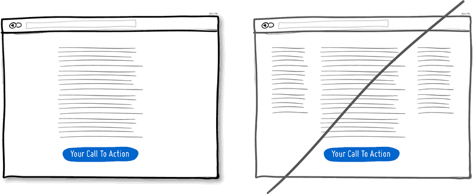

## 2. 使用礼品诱惑代替生硬的推销

例如可以给用户提供礼物来表达你的友善姿态。更深层的讲，送礼是一种基于互惠原则的有效说服策略。显而易见的好处是让你在往后的活动进展中更加顺利。

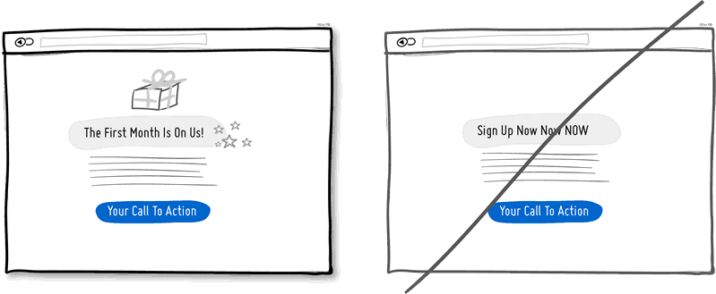

## 3. 合并重复的功能避免分散

随着时间的推移，不可避免的你增加了很多模块、元素，而且功能相同。碎片化的界面会增加用户的学习曲线，所以需要合并重复的功能，重构你的界面。

## 4. 用户的评价好过自卖自夸

用户好评是另一个可以提高转化率的说服策略。当潜在客户看到其他人对你的服务给予好评时，项目机会会大增。所以试着提供一些含金量高的证据证明这些好评是真实可信的。

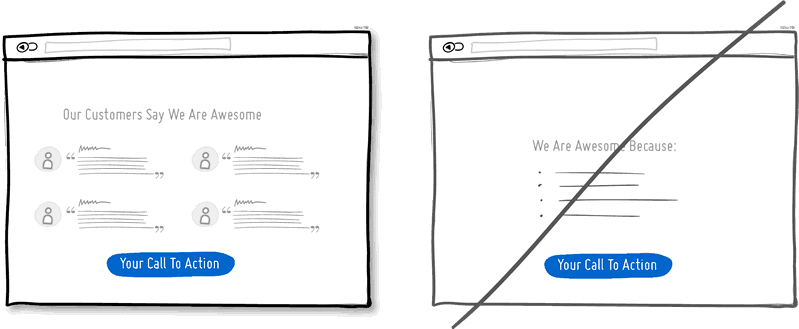

## 5. 重复你的主行动按钮

多次重复主行动按钮的方法适用于界面很长或者分页的情况。

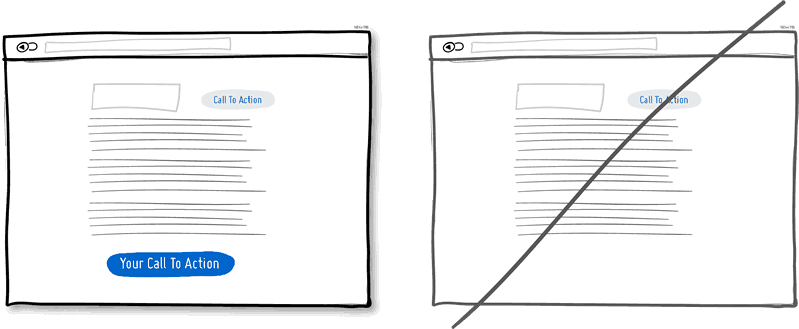

## 6. 区分开可点击和已选择的样式

视觉风格，如颜色、深度和对比度都可以当做可靠的线索以帮助人们了解你的导航界面：我在哪里，我能去哪里。为了让用户清晰，可点击元素（链接，按钮）、已选择元素（选择的菜单）、以及纯文本的样式应该是彼此明显不同，而且在界面上要保持一致性原则。在视觉上，我们一般认为蓝色表示可被点击，黑色表示已被选择或是什么。

## 7. 给出推荐而不是让用户来选择

当列出许多选项时，给出一个重点推荐项是个不错的做法，尽管推荐的设置无法满足所有用户，但这么做是有理论依据的：当面临的选择越多时，用户就越难做出决定（决策瘫痪）。所以你可以高亮某个选项来帮助用户做出选择。

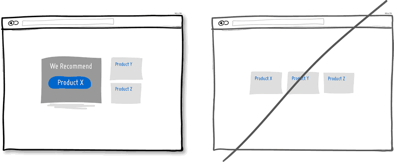

## 8. 使用恢复功能代替弹出对话框

假设你刚点击了一个链接或者按钮，撤销操作可以让操作流畅自然，也更符合人类的本能。而每次操作都弹一个确定框则好像是在质问用户你明白不明白这个操作会产生什么后果。其实只有极少数情况下才会发生误操作。所以，为了防止误操作而设计的确认窗口其实是不人性化的，用户每次操作都需要进行毫无意义的确定。所以请考虑在你的产品里实现撤销操作来提升用户的操作友好度吧。

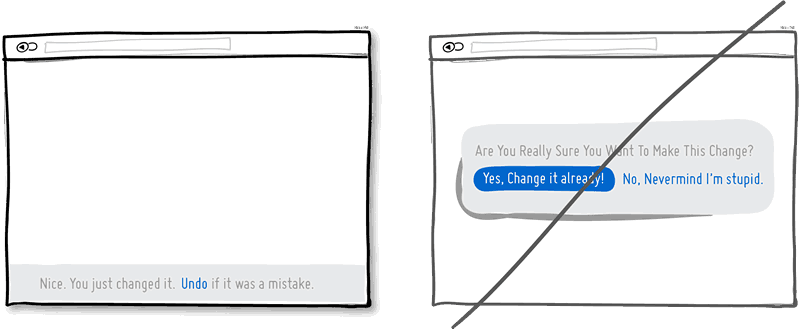

## 9. 明确产品适用人群而不是面向所有人

你是想把产品做成大众化的还是有精确的适用人群呢？答案是：在产品定位上你需要更精确些。把产品定位得精确的风险就是可能缩小了目标潜在用户的范围，但这种更专业的精神却反过来会赢得信任、权威。

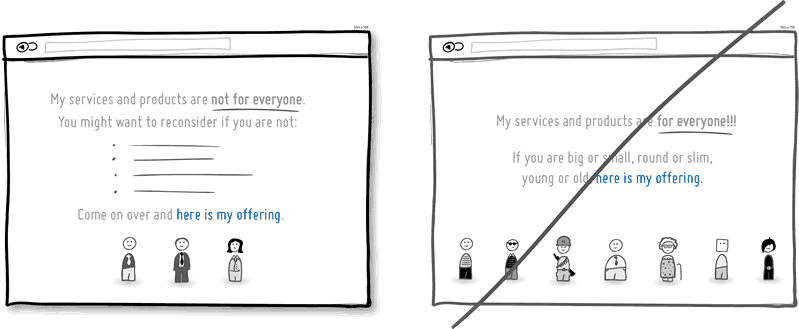

## 10. 直接果断而不是犹犹豫豫

你可以通过不确定而颤抖的声音来表达传递自己的意思，也可以通过很自信的方式表达。如果你在界面中的表述多以问号结束，比如”也许”，”可能”，”感兴趣？” 或者”想要试试么？”，那么你完全可以把语气变得更坚定一些。不过万事无绝对，适当放松措词让用户有自行思考的余地也是可以的。

## 11. 界面要对比鲜明让人容易区分

把主要功能区从界面中突出显示出来效果会好很多。使你的主要口号醒目有很多种方法。通过明暗色调的对比来突显。通过为元素添加阴影、渐变等效果让界面富有层次感来张显主题。最后，你甚至可以在色相环上专门选择互补色（比如黄色与紫色）来设计你的界面，以达到突出重心的目的。综合所有这些，最后得到的界面会使你的主要意图与界面其他元素有明显的区分，得到完美的呈现。

## 12. 个性鲜明胜过普通

介绍你自己或产品时附带上名称、图片或原产地可以让与用户的交流沟通更加的个人化，当你在界面设计中实现这点时，让人觉得非常友好。同时指明区域也会隐形提高产品的声誉，好上加好。

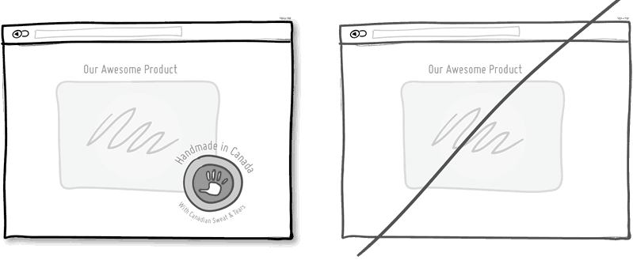

## 13. 精简表单填写内容

人本性懒惰，没人愿意填写一大堆表单字段。表单中每个字段都会有失去用户的风险。多想想是不是每个字段都是必须的。如果你确实需要一大堆信息让用户填写，试着将它们分散在不同页面，在表单提交后还可以继续补充。

## 14. 暴露选项而不是隐藏

你使用的任何一个下拉框都会对用户造成信息的隐藏，需要额外的操作才能显示。如果这些信息是贯穿整个操作所必需的，那你最好把它展示出来做得更显而易见一点。下拉框最好用在选择日期，省份等约定俗成的地方。对于程序中重要的选项最好还是不要做成下拉形式。

## 15. 把界面做得环环相扣要好过直白的排版

一个平淡无奇行文无疑会让用户失去兴趣而放弃继续阅读。单列滚动的长页面是不错的，但是我们应该适当地设置一些小节，并且环环相扣，来提高用户的兴趣使其继续阅读。但需要注意的是节与节之间的留白不要太大。

## 16. 不要放太多链接分散用户注意力

为了满足各式用户的需求，在页面上放些链接链到这里、链到那里是常见的做法。如果你的主要目的是想让用户点击页面最后那个下载按扭什么的话，就需要三思了。因为用户可能点击了其他链接离开页面了。所以你需要注意页面的链接数量，把导航和操作链接用样式区分开，尽量移除页面不需要的链接。

## 17. 将操作的状态或者进度呈现出来

现如今大多界面当中已经呈现了各色样式的进度条或者标明状态的图标，比如邮件有已读或未读的状态，电子帐单有支付或未支付的状态。而在界面上呈现这样的状态对于用户来说是很有必要的。这样用户就可以知道某些操作是否成功，接下来准备进行怎样的操作。

## 18. 使用获利按钮（好处说明）代替普通的按钮

试想界面上有这样两个按钮：一个是”帮你省钱”，另一个是”立即注册”。我敢打赌大多数人会点击第一个，因为第二个按扭让人感觉不到有利可图，并且”注册”让人联想到填不完的表单。也就是说让用户感受到获利的按钮更有可能被点击。这种让用户感到好处的文字信息也可放在按钮旁边，不一定要做为按钮的标题。当然，正常的按钮还是有用处的，一般用于重复性操作频繁的地方。

## 19. 使用直观的操作而不是缺乏上下文关联的菜单

直接在元素身上进行操作是更直观明了的方式。比如在一个列表中，我们想让用户对每个条目进行操作那么就把按钮放到当前条目上，而不要把放到列表之外。再比如就是直接点击元素就进入编辑状态（比如页面上的地址信息点击后可以进行编辑）。这种方式比传统的选中再点击相应的按钮进行操作要简洁省事得多。当然，对于一般性的操作本身就不需要有什么上下文的，就没必要这么做了，比如页面上的前进，后退按扭。

## 20. 尽量直接显示表单而不要额外页面

在一个足够大的宽屏界面上最好还是直接给出表单，这比点击按钮再弹出表单要好很多。首先减少了点击操作，流程变得简洁也节省了时间。其次，直接呈现出表单可以让用户知道表单有多长，其实也是在告诉用户注册花不了多少时间。当然，这条规则适合注册表单非常简单的情况。

## 21. 让界面平滑显示而不要死板地呈现

用户进行操作过程中，界面上的元素会经常出现，隐藏，打开，关闭，放大缩小移位等。给这些元素增加些自然的动画，淡入淡出效果不但美观，也更符合实际，本来元素尺寸位置的变化就是一个需要时间的动画过程。但要注意动画时间不要设置过长，那样会让想尽快完成操作的用户不耐烦。

## 22. 使用逐步的引导代替突兀的注册

与其让用户马上注册，何不让用户先进行一些体验式的操作呢。这个体验过程可以展示程序的功能，特性等。一旦用户通过简单几步的操作了解了程序的价值所在，那么它会更愿意填写注册表单的。这种循序渐进的引导可以尽量推迟用户注册的时间但又可以让用户在没注册的情况下进行个性化设置等简单操作。

## 23. 减少边框避免浪费注意力

过程边框会喧宾夺主。不用说，边框确实在划分区域进行版块设置时有很大的作用，但同时其明显的线条也会吸引走用户的注意力。为了达到划分版块又不转移用户注意力的目的，在排版时可以将界面上不同区域的元素通过空白进行分组，用上不同的背景色，将文字对齐方式进行统一，还有就是为不同区域设置不同的样式。当使用所见即所得的界面设计工具时，我们经常在界面上方便地拖出很多区块来，这些区块多了就会显得杂乱无章。所以我们又会到处放些横线来分界。一个更好的做法是将区块垂直对齐，这样做不会让那些多余的线条来扰乱视觉。

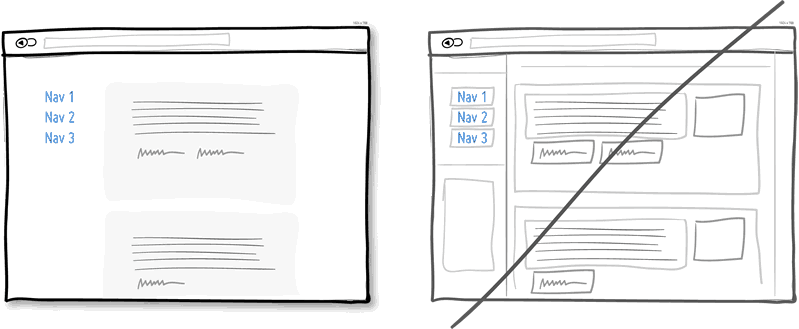

## 24. 展示产品带来的好处而不要罗列产品特性

市场就是这样的，用户永远只关心自身利益而产品特性对他们来说倒不是那么重要。只有利益才更直观地体现出使用产品所带来的价值。Chris Guillebeau在他的著作《100美元起家》中指出，相比压力，冲突，烦心事和未知的未来，人们在乎得更多的是爱，金钱，认同感和自由支配的空闲时间。所以我相信在展示产品特性时回归到利益上是必要的。

## 25. 要设计好没有数据时的展现

界面上经常需要呈现不同数量的数据，从0，1，10，100到10000+等。这里存在个普遍的问题就是：在程序最开始使用的0条数据到过度到有数据之前，该如何进行显示界面。这也是我们经常忽视了的地方。当程序初始没有数据时，用户看到的就是一片空白，此时用户可能不知道该进行哪些操作。利用好没有数据的初始界面可以让用户学习和熟悉如何使用程序，在程序中创建数据。力臻完美永远是我们追求的目标，界面设计也不例外。

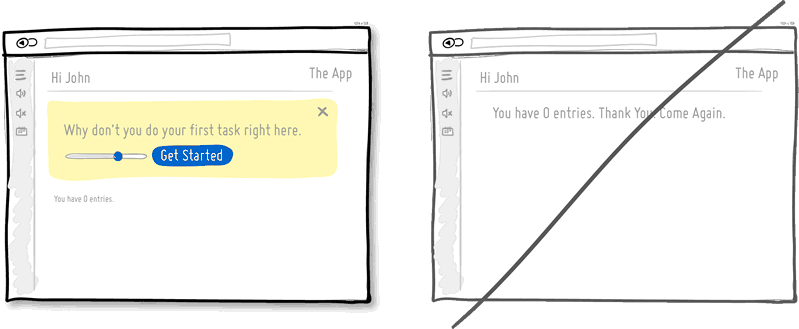

## 26. 尝试默认选择

将界面做成默认用户选中想要使用你的产品，意味着如果用户真的需要使用，那么可以直接点击确定而不需要额外点选了。当然，将界面设计成默认选择的样子多少存在点争议，有点强迫用户的感觉。如果你想道德一点，你可以要么把让用户选择的文字写得模棱两可，要么使用双重否定这样不那么直白的描述，这两种方式都可以让用户觉得没有那么强的感觉是被强迫选择使用产品的。

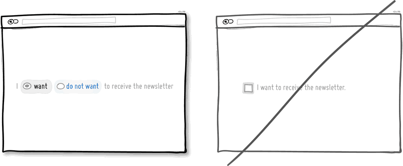

## 27. 保持界面一致性，不要增加用户的学习成本

自从Donald Norman的一系列著作面世后，界面设计中尽量保持一致性成了一个普遍遵循的准则。在设计中保持一致性可以减少用户的学习成本，用户不需要学习新的操作。当我们点击按钮，或者进行拖拽操作，我们期望这样的操作在整个程序的各个界面都是一致的，会得到相似的结果出来。不过在让界面变得一致之前，记住一点，适当的打破整体的一致性也是可取的。这偶尔的不一致性的设计用在你需要强调的地方可以起到很大的作用。所以世事无绝对，我们应遵从一致的设计准则，但适当地打破这种常规。

## 28. 使用合适的默认值，减少用户的额外操作

适当的默认值和预先填充好的表单字段可以大量减少用户的工作量。在节省用户宝贵的时间上面，这是种非常常见的做法，可以帮助用户快速填完表单或者注册信息。

## 29. 遵循惯例避免重复造轮子

界面设计中遵从惯例跟之前的界面一致性准则很相似。如果我们遵从了界面设计中的一些约定，用户用起来会很方便。相反，不一致和没有遵从惯例则会提高学习成本。有了界面设计中这些约定，我们想都不用想就知道界面右上角（大多数情况下）的叉叉是关闭程序用的，或者点击一个按钮后我们能够预测到将会发生什么。当然，惯例是会过时的，随着时间的推移，同样的操作也有可能被赋予新的含义。但要记住，当你在界面中打破这些常规时一定要目的明确，并且出发点是好的。

## 30. 让用户觉得可以避免失去而不是获得

我们喜欢成功，没有谁愿意失败。根据心理学得到的可靠结论，人们一般更顷向于避免失去拥有的东西而不是获得新的利益。这一结论也适用于产品的设计和推广中。试着说明你的产品会帮助客户维护他的利益，保持健康，社会地位等要好过告诉客户这个产品会带来一些他未曾拥有的东西。比如保险公司，它是在销售我们出事之后可以得到的大笔赔偿呢还是在强调可以帮助我们避免失去拥有的财产？

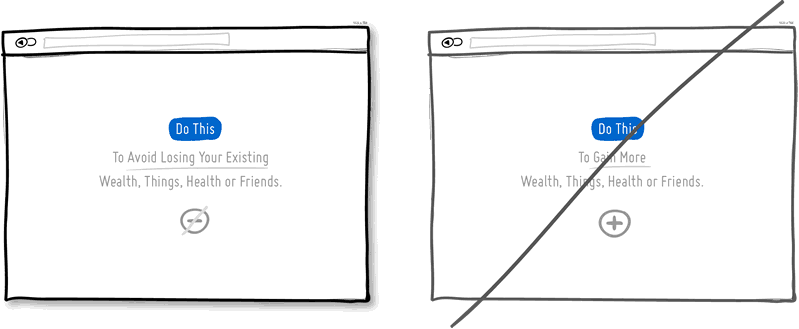

## 31. 具有层次的图形化展示优于直白的文字描述

具有层次的设计可以将界面上重要的部分与不次要部分区分开来。要让界面层次分明，可以在这些方面做文章：对齐方式，间距，颜色，缩进，字体大小，元素尺寸等。当所有这些调整运用得适当时，可以提高整个界面的可读性。相比在一个很直白的界面上用户一眼就可以从上瞟到底的设计，这样分明的设计也可以让用户放慢速度来慢慢阅读。这样也使界面更有特色一些。就好比一次旅行，你可以乘坐高铁快速到达景区（从页面顶部瞟到底部），但你也可以慢行以欣赏沿途风光。所以层次分明的设计让眼睛有可以停留的地方，而不是对着空白单调的一个屏幕。

## 32. 将有关联的东西分组避免杂乱无章

将各个功能项分组合并起来可以提高可用性。有点常识的人都知道刀子和叉子，或者打开文件和关闭文件是放在一起的。将功能相近的元素放在一起也符合逻辑，符合我们平时的认知。

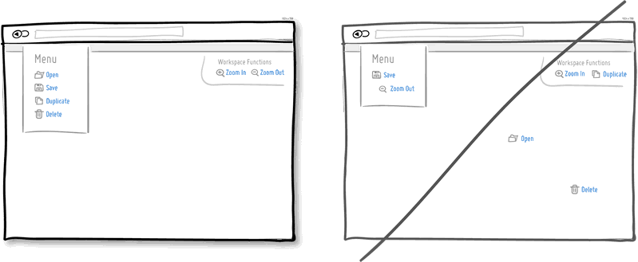

## 33. 使用行内即时校验而不是提交后再告诉出错

在处理表单时，最好立即检测出用户所填写内容是否符合要求然后给出验证消息。这样错误一出现能就能得到改正。相反，提交后再检查表单会给出错误消息，会让用户感到不爽又要重复之前的工作。

## 34. 放宽对用户输入的要求

对用户输入的数据，尽量放宽限制，包括格式，大小写什么的。这样做可以更人性化一点，也使得界面更加友好。一个再恬当不过的例子就是让用户输入电话号码的时候，用户有很多种输入方式，带括号的，带破折号的，带空格的，带区号和不带区号的等等。如果你在代码中来处理这些格式的问题，代价也只是你一个人多写几行代码而以，却可以减少无数用户的工作量。

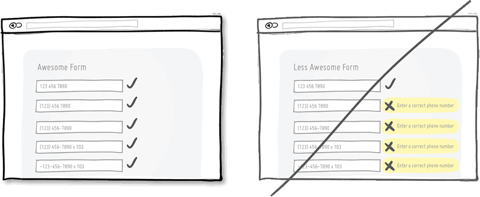

## 35. 让用户感觉需要快速做出响应而不是毫无时间观念

适当的紧迫感是个有效的战术可以让用户立即做出决定而不是等上个十天半个月。重要的是这种战术屡试不爽，因为它暗示了资源的紧缺或者活动的时间有限，今天可以买，但明天可能就无法这么低价了。另一方面，这一战术也让用户感到会错失一次大好的机会，再一次，应用了人们害怕失去的本性。当然，这种战术会被一些人嗤之以鼻，认为是不耿直的做法。不过，这只是种战术而以，并且在保持合法性的前提下应用也无伤大雅。所以请不要为了营销而在界面上制造紧迫的假象。

## 36. 尝试饥饿营销（制造稀缺感）

物以稀为贵。饥饿营销给出的信息就是东西不多，只剩几件，明天再来，可能没了。你去比较一下批发与限量版的东西他们的价格差距有多大就知道了。回过头来看，那些批发商或者大零售商，他们也使用饥饿营销，以获得更好的销量。但在软件行业，我们经常会忘记有饥饿营销这回事。因为数字产品是可以很容易拷贝复制的，不存在缺货的情况。其实，在界面设计中，也可以将其运用起来与现实中的资源紧缺进行联系。想想一次网上研讨会的门票，想想你一个月可以服务的人数限制，这些信息都可以告知用户是有限的。

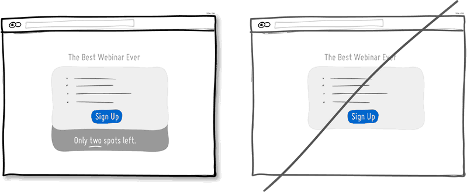

## 37. 让用户从已知里选择而不是直接回想

这一界面设计中的经典准则是有心理学依据的，相比要让某人回想想某样东西，从一堆东西中认出某样东西会更容易些。辨识出一样东西只需要我们稍微回忆一下，通过一些线索就可以完成。而回想则需要我们全面搜索自己的大脑。也许这也是为什么试卷上选择题会比简答题做得快的原因。所以试着在界面上展示一些用户之前涉及到的信息让他们进行选择，而不是让他们想半天然后自己填写。

## 38. 让点击区域更大

像链接，表单的输入框还有按钮等，如果尺寸做得大一点则点击起来更方便容易些。根据费特定律，使用像鼠标这样的外设来点击需要一些时间，特别是元素比较小的情况下，时间会更多。鉴于此，最好还是把你的表单输入框，按钮等做大点。抑或者你可以保持原有的设计不变，只是把元素可点击区域（也就是热区）增大。这样的一个典型例子是手机设备上的文本链接和导航菜单，它们文字不一定很大但背景是拉伸的，在很宽范围内点击都有效。

## 39. 优化页面加载速度，不要让用户等太久

速度很重要。页面加载速度和UI对操作的响应速度都直接关系到用户是否有耐心继续等下去。无疑地每多一秒种的等待都会失去一些用户或者机会。一个好的解决之道当然就是优化你的页面和图片。除此之外还可以运用心理学让这个等待时间显得不那么长。具体来说有两种技巧。一是显示进度条，二是展示其他相关或有趣的东西来吸引用户的注意力（就好比你沿着传送带走走总比傻站在原地盯着一个位置看要好得多吧）

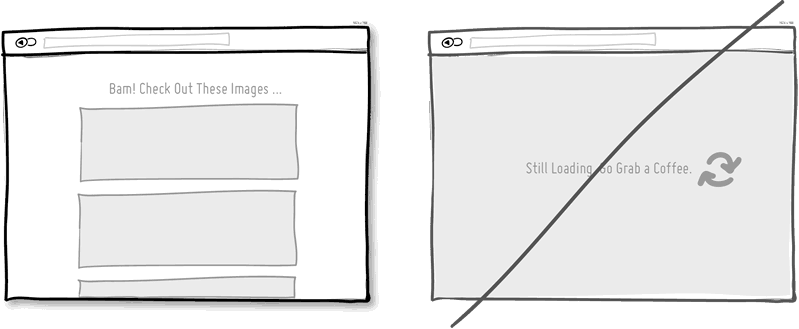

## 40. 除了按扭外，建议增加快捷键支持

当你的程序广为流传，应该考虑下高级用户的感受。人们总是试图为一些重复性的操作找到更快捷的方法，快捷键就应运而生了。相比在界面上点来点去，快捷键无疑大大提高工作效率。一个好的例子就是现今流行于各个主流程序中的J（后退）K（前进）快捷键组合，比如在Gmail，Twitter和Tumblr中。按钮固然好，但快捷键会锦上添花。

## 41. 尝试锚定价格

就像卡尼曼观察到的那样，锚定效应造成的认知偏差是人类很难克服的，我们的决策受最先进入我们大脑的数字的影响，锚定数量也并不一定是一个价格，它可以是一个数。营销人员利用锚定效应最常见的例子是同时显示建议零售价和实际价格。

## 42. 让进度条预设已经走了一部分

一件事越接近完成我们的动力越强，这被称为目标梯度效应。让人觉得自己已经取得了进展这件事宜早不宜晚。

渐进显示不让大量无关的信息直接暴露出来，而且展现的内容有上下文的关联，更容易让用户理解，不会一下展现太多表单把用户吓跑。

## 44. 用小的承诺代替大的

使用承诺是一个功能强大的说服策略，充分挖掘人的自我认知一致性原则，一连窜的小问题答案的”是“，会得到更大问题的“是的。” 还有显示月费而不是年费会传达出一种没有合约的感觉，让用户觉得随时可以退出，没有障碍。

## 45. 替换模态对话框为更温柔的提示方式

虽然模态对话框更吸引用户注意力，但是也会带来一些其他问题，首先阻止了用户操作对话框之外的操作，而且打断了用户之前的操作动作，为什么不尝试行内或滑出等不那么碍眼的提示方式呢？

## 46. 尝试多功能控制而不是分成很多功能块

例如可以在输入框里实现筛选过滤的功能，而不用增加额外的筛选菜单。打分功能里增加悬停显示功能而不是增加额外的显示模块。但是不要滥用，否则会增加用户的学习曲线难度。

## 47. 尝试增加图标文本

图标和文字在一起可以减少很多歧义，比如以下下箭头到底是表示往下移？降低优先级还是下载呢？或者”X“图标代表删除？禁止还是关闭呢？ 当用户没有时间理解你界面图标表达的意思的时候问题就麻烦了，所以为了理解，最好图标要配上文本，如果空间实在不够，可以用悬停图标显示提示文本的方式展现。

## 48. 尝试使用更自然的语言代替干瘪的文本

自然语言比简短、严格的短语更方便用户理解。

## 49. 激发用户的好奇心

提供一个能激发用户好奇心的信息，这可能是一个样章、演示、试用，或做了XYZ才能看得到的免费内容。

## 50. 尝试消除用户顾虑而不是假设一切正常

告诉你的客户支付是安全的、货物免运费而且随时可以退换，没有任何后顾之忧，这是能提高转化率的极佳策略。

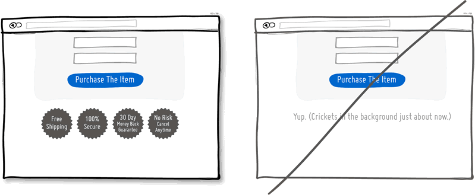

## 51. 尝试价格错觉

改变提示方式让人们完全靠自己判断你的产品的价值，也可以帮助他们做。如果你决定利用人类不理性，就可以用不同价格的显示方式，让你的产品变得视为更有价值。比如在价格前加上“只”，“实惠”等词。把价格分解为每单位价格（例如：每天1块钱，而不是一月30块会员费） 另外，可以使用以9结尾的数来减少价格位数。

## 52. 尝试感谢你的用户而不是简单的完成确认

感谢的可以让你的业务，产品或UI更加人性化，表达了对用户的欣赏和关心。感谢可以引导出进一步的对话或行动。感谢您阅读这一段。 :)

## 53. 直接给出有意义的结果不要让用户做数字转换工作

比如显示3分钟前就比显示一个时间日期更容易理解，让用户免除一切数学计算。

## 54. 给予用户再次确认选择的自由

在行动按钮或选择之后告诉用户有自我选择或拒绝的自由。

## 55. 让奖励变得随机

可变的随机的奖励会让用户上瘾（游戏让人上瘾的原理之一）

## 56. 抓住用户的注意力

可以用增加尺寸和提高对比度的方式来突出重要行动。其他吸引注意力的方法有：采用不规则形状，自动焦点，高亮，固定跟随（浮动），以及方向箭头等。

## 57. 让表格对比清晰明确

表格应该显示出最相关的属性差异，有助于用户做出单个决定。

## 58. 显示一组而不是单独的一项

人有收集东西的癖好，无论是物理的还是虚拟的。收集一整套东西会自然的成为奋斗目标。通常获得一整套东西带来的收益增加（蛋糕比其单独的成分更大、更好）。通过显示过去的收获也会增强以后的行为动机。

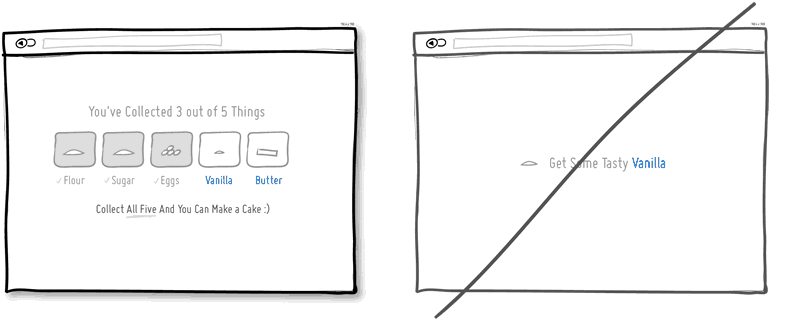

## 59. 让用户有明晰的期望而不是蒙在鼓里

你在X步骤中的第一步。你的选择结果在Y中。在Z之前你会收到XX，下一个任务将全部完成。这种不断的清晰的提示可以建立与用户之间的信任，而不是让用户两眼摸黑。

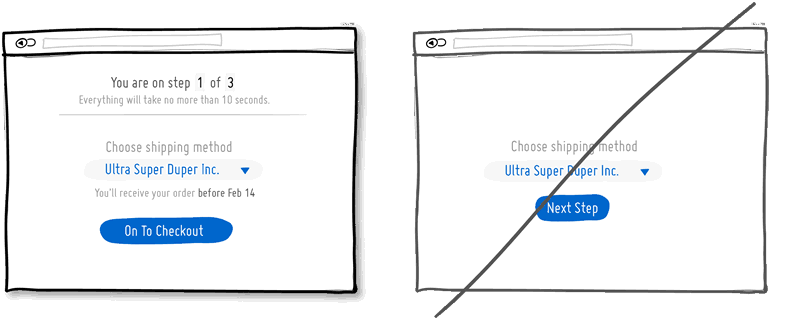

## 60. 用幽默代替严肃

为什么要一直那么严肃呢？在你的UI里加入一些幽默的元素有助于与你的用户/客户之间建立良好的情感联系，也更容易原谅你的一些错误。

## 61. 用反馈代替沉默

当我们执行了一个动作，肯定我们希望知道是否成功。比如：当我们发送邮件时候希望知道是否发送成功。什么反馈也没有意味着不确定性：起作用了么？点击了么？按钮按下去了么？是否要重试？ 成功提醒是非常有价值的交互。

## 62. 判断出用户意图

如下图所示，这是亚马逊的一个多级菜单，当第一个菜单展开，用户鼠标往右下角移动路过第二个菜单的时候，之前的展开的菜单并不会消失，他们靠算法预判到用户可能是想点击第一个菜单下的某个子菜单。

## 63. 使用宽松的间隔避免元素挤在一起

空白的填充可以让内容和表格的可读性更好，广泛适用于列表、表格、段落等元素。

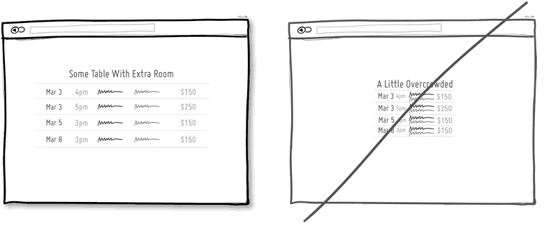

## 64. 使用讲故事的方式而不是列出事实

讲故事是最古老的传播方式，可以在着页面和各种UI交互页使用。一个基本的故事有几个简单的元素，如场景，带着目的的人物，遇到的问题。故事可以引发读者的情感反应，就像自己遇到了同样的处境。这样，故事也可变得更加难忘。这也就是为什么销售长久以来喜欢讲故事，说明这非常有效的。

## 65. 使用可靠的内容，避免造假

人们可以一眼就看出太假的东西，为了让你的产品更值得信赖，不要造假。股票高高的走势图和网页上开心笑的人没有任何理由和意义。混杂着好和坏的评价，非整数数字让你的网页更真实可靠。

## 66. 随着用户的进阶而优化

当用户对你的操作界面很熟悉之后，一些给新手显示的东西或者一些经常显示的东西变得不那么重要，可以去掉或者移动其他地方。这样可以让设计更加精简。

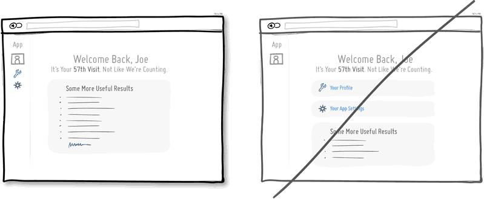

## 67. 以别人为中心

想建立社会影响力的时候就要优先考虑别人的利益，把对话中的”我“变成”你“。

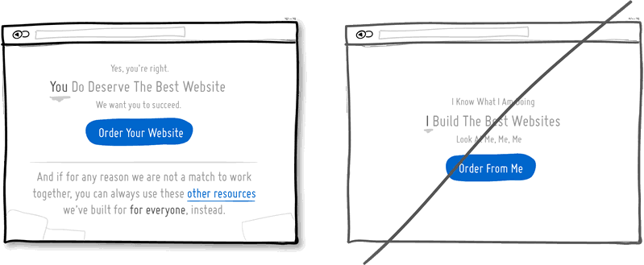

## 68. 对于你显而易见的东西可能对于别人不是

有些事情对于我们来说似乎是显而易见的，对于别人却不是。如下图中让用户输入URL快捷方式，用户不一定知道指的是什么：

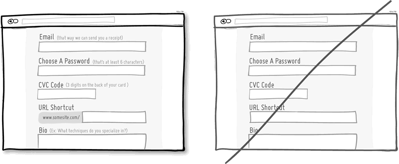

## 69. 让语言简洁明了，去掉多余的废话

使用更少，更简洁的话，在写完草稿后，看看是否还可以缩减。抓住要点可以避免丢掉用户的注意力。

## 70. 使用响应式布局避免静态布局

没有什么比出现横纵双滚动条更糟糕的页面了，让页面支持的响应式布局，这样在各种大小的移动设备上都能良好的显示。

## 71. 让视觉效果清晰明确

让不同的元素成组，使用不同的字号，使用不同的色调，让视觉效果清晰明确。

## 72. 让你的界面可纠错

出错是难免的，所以用户界面应该允许细微的纠正。如更换账号或更换地址等

## 73. 让用户尝试社会承诺

人类偏爱一致的自我形象，社会承诺会成为一种自我动机。在这一点上，公开的社会承诺，会让人更有责任去兑现。当我们告诉人们，我们会做一些事情（或者采取公开的行动），那么未来行动的可能性就会更高。

## 74. 增加重试和重做的功能

例如：当上传图片时候，文件上传失败或者对上传的图片不满意想换一张的时候，重试和重做就很有必要。

## 75. 把过多的选择去掉

更多的选择让决策越难，甚至还会降低满意度，因为这让后悔和自责倾向增加。著名的果酱研究实验一次次的被验证。

本文由
[36kr](http://36kr.com/p/5041515.html)
[PMCAFF产品经理社原创专栏作者](http://www.pmcaff.com)
[乔向](http://www.pmcaff.com/user/profile?name=%E4%B9%94%E5%90%91%E9%98%B3)
翻译自 [GoodUI](http://goodui.org)