# 最強 UI 設計守則：遵守以下 75 點，讓你擁有完美界面設計

一個好的界面設計應該擁有高轉化率且方便用戶使用，換句話說：既能達到商業目的又能滿足方便易用的要求

## 1. 使用單欄佈局代替多欄佈局
單欄佈局能夠讓用戶對全局有更好的掌控，對內容一目了然。而多欄佈局可能會分散用戶注意力。最好的做法是用一個有邏輯的敘述來引導用戶並在末尾放上你的行動按鈕。

## 2. 使用禮品誘惑代替生硬的推銷
例如可以給用戶提供禮物來表達你的友善姿態。更深層的講，送禮是一種基於互惠原則的有效說服策略。顯而易見的好處是讓你在往後的活動進展中更加順利。

## 3. 合併重複的功能避免分散
隨著時間的推移，不可避免的你增加了很多模塊、元素，而且功能相同。碎片化的界面會增加用戶的學習曲線，所以需要合併重複的功能，重構你的界面。

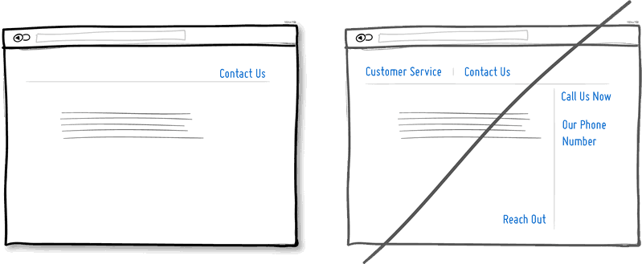

## 4. 用戶的評價好過自賣自誇
用戶好評是另一個可以提高轉化率的說服策略。當潛在客戶看到其他人對你的服務給予好評時，項目機會會大增。所以試著提供一些含金量高的證據證明這些好評是真實可信的。

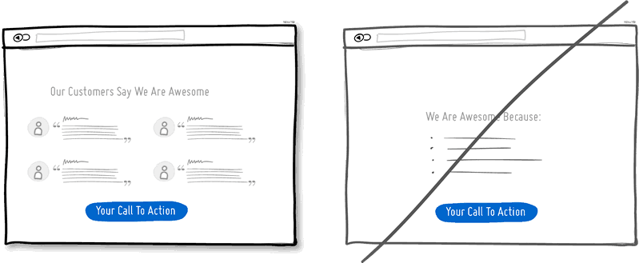

## 5. 重複你的主行動按鈕
多次重複主行動按鈕的方法適用於界面很長或者分頁的情況。

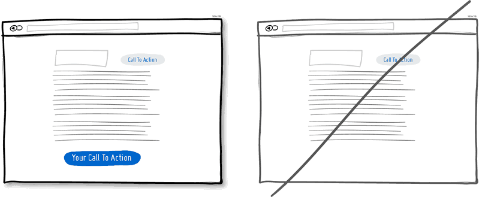

## 6. 區分開可點擊和已選擇的樣式
視覺風格，如顏色、深度和對比度都可以當做可靠的線索以幫助人們了解你的導航界面：我在哪裡、我能去哪裡。

為了讓用戶清晰，可點擊元素（鏈接，按鈕）、已選擇元素（選擇的菜單）、以及純文本的樣式應該是彼此明顯不同，而且在界面上要保持一致性原則。在視覺上，我們一般認為藍色表示可被點擊，黑色表示已被選擇或是什麼。

## 7. 給出推薦而不是讓用戶來選擇
當列出許多選項時，給出一個重點推薦項是個不錯的做法，儘管推薦的設置無法滿足所有用戶，但這麼做是有理論依據的：當面臨的選擇越多時，用戶就越難做出決定（決策癱瘓）。所以你可以高亮某個選項來幫助用戶做出選擇。

## 8. 使用恢復功能代替彈出對話框
假設你剛點擊了一個鏈接或者按鈕，撤銷操作可以讓操作流暢自然，也更符合人類的本能。而每次操作都彈一個確定框則好像是在質問用戶你明白不明白這個操作會產生什麼後果。

其實只有極少數情況下才會發生誤操作。所以，為了防止誤操作而設計的確認窗口其實是不人性化的，用戶每次操作都需要進行毫無意義的確定。所以請考慮在你的產品裡實現撤銷操作來提升用戶的操作友好度吧。

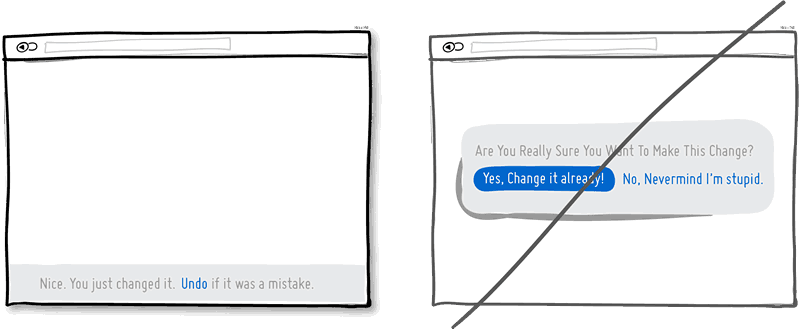

## 9. 明確產品適用人群而不是面向所有人
你是想把產品做成大眾化的還是有精確的適用人群呢？答案是：在產品定位上你需要更精確些。

把產品定位得精確的風險就是可能縮小了目標潛在用戶的範圍，但這種更專業的精神卻反過來會贏得信任、權威。

## 10. 直接果斷而不是猶猶豫豫
你可以通過不確定而顫抖的聲音來表達傳遞自己的意思，也可以通過很自信的方式表達。如果你在界面中的表述多以問號結束，比如「也許」、「可能」、「感興趣？」或者「想要試試麼？」，那麼你完全可以把語氣變得更堅定一些。不過萬事無絕對，適當放鬆措詞讓用戶有自行思考的餘地也是可以的。

## 11. 界面要對比鮮明讓人容易區分
把主要功能區從界面中突出顯示出來效果會好很多，使你的主要口號醒目有很多種方法：通過明暗色調的對比來突顯、通過為元素添加陰影、漸變等效果讓界面富有層次感來張顯主題。最後，你甚至可以在色相環上專門選擇互補色（比如黃色與紫色）來設計你的界面，以達到突出重心的目的。

綜合所有這些，最後得到的界面會使你的主要意圖與界面其他元素有明顯的區分，得到完美的呈現。

## 12. 個性鮮明勝過普通
介紹你自己或產品時附帶上名稱、圖片或原產地可以讓與用戶的交流溝通更加的個人化，當你在界面設計中實現這點時，讓人覺得非常友好。同時指明區域也會隱形提高產品的聲譽，好上加好。

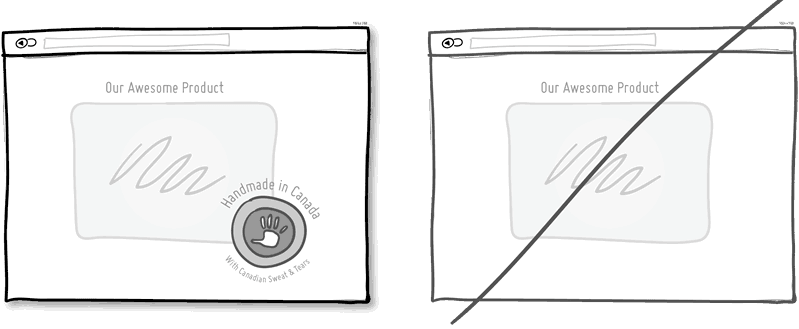

## 13. 精簡表單填寫內​​容
人本性懶惰，沒人願意填寫一大堆表單字段。表單中每個字段都會有失去用戶的風險。多想想是不是每個字段都是必須的。如果你確實需要一大堆信息讓用戶填寫，試著將它們分散在不同頁面，在表單提交後還可以繼續補充。

## 14. 暴露選項而不是隱藏
你使用的任何一個下拉框都會對用戶造成信息的隱藏，需要額外的操作才能顯示。如果這些信息是貫穿整個操作所必需的，那你最好把它展示出來做得更顯而易見一點。

下拉框最好用在選擇日期，省份等約定俗成的地方；對於程式中重要的選項最好還是不要做成下拉形式。

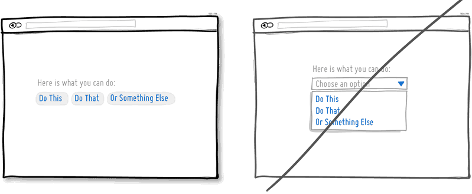

## 15. 把界面做得環環相扣要好過直白的排版
一個平淡無奇行文無疑會讓用戶失去興趣而放棄繼續閱讀。單列滾動的長頁面是不錯的，但是我們應該適當地設置一些小節，並且環環相扣，來提高用戶的興趣使其繼續閱讀。

但需要注意的是節與節之間的留白不要太大。

## 16. 不要放太多鏈接分散用戶注意力
為了滿足各式用戶的需求，在頁面上放些鏈接鏈到這裡、鏈到那裡是常見的做法。如果你的主要目的是想讓用戶點擊頁面最後那個下載按扭什麼的話，就需要三思了。因為用戶可能點擊了其他鏈接離開頁面了。所以你需要注意頁面的鏈接數量，把導航和操作鏈接用樣式區分開，盡量移除頁面不需要的鏈接。

## 17. 將操作的狀態或者進度呈現出來
現如今大多界面當中已經呈現了各色樣式的進度條或者標明狀態的圖標，比如郵件有已讀或未讀的狀態，電子帳單有支付或未支付的狀態。而在界面上呈現這樣的狀態對於用戶來說是很有必要的。這樣用戶就可以知道某些操作是否成功，接下來準備進行怎樣的操作。

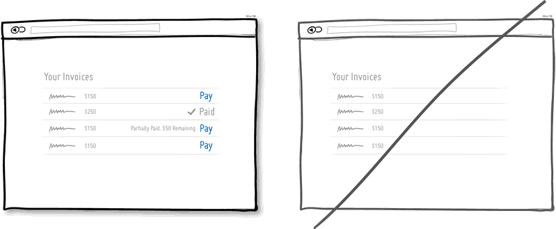

## 18. 使用獲利按鈕（好處說明）代替普通的按鈕
試想界面上有這樣兩個按鈕：一個是「幫你省錢」，另一個是「立即註冊」。我敢打賭大多數人會點擊第一個，因為第二個按扭讓人感覺不到有利可圖，並且「註冊」讓人聯想到填不完的表單。

也就是說讓用戶感受到獲利的按鈕更有可能被點擊。這種讓用戶感到好處的文字信息也可放在按鈕旁邊，不一定要做為按鈕的標題。當然，正常的按鈕還是有用處的，一般用於重複性操作頻繁的地方。

## 19. 使用直觀的操作而不是缺乏上下文關聯的菜單
直接在元素身上進行操作是更直觀明了的方式。比如在一個列表中，我們想讓用戶對每個條目進行操作那麼就把按鈕放到當前條目上，而不要把放到列表之外。

再比如就是直接點擊元素就進入編輯狀態（比如頁面上的地址信息點擊後可以進行編輯）。這種方式比傳統的選中再點擊相應的按鈕進行操作要簡潔省事得多。當然，對於一般性的操作本身就不需要有什麼上下文的，就沒必要這麼做了，比如頁面上的前進，後退按扭。

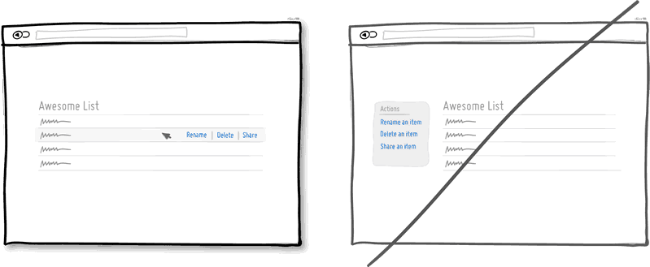

## 20. 盡量直接顯示表單而不要額外頁面
在一個足夠大的寬螢幕界面上最好還是直接給出表單，這比點擊按鈕再彈出表單要好很多。首先減少了點擊操作，流程變得簡潔也節省了時間。其次，直接呈現出表單可以讓用戶知道表單有多長，其實也是在告訴用戶註冊花不了多少時間。當然，這條規則適合註冊表單非常簡單的情況。

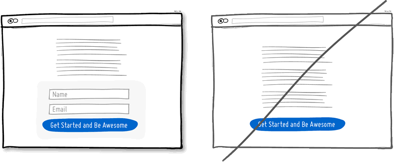

## 21. 讓界面平滑顯示而不要死板地呈現
用戶進行操作過程中，界面上的元素會經常出現隱藏、打開、關閉、放大、縮小、移位等。給這些元素增加些自然的動畫，淡入淡出效果不但美觀，也更符合實際。

本來元素尺寸位置的變化就是一個需要時間的動畫過程，但要注意動畫時間不要設置過長，那樣會讓想盡快完成操作的用戶不耐煩。

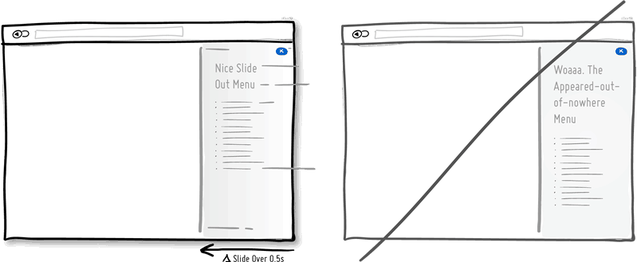

## 22. 使用逐步的引導代替突兀的註冊
與其讓用戶馬上註冊，何不讓用戶先進行一些體驗式的操作呢。這個體驗過程可以展示程式的功能、特性等。一旦用戶通過簡單幾步的操作了解了程式的價值所在，那麼它會更願意填寫註冊表單的。這種循序漸進的引導可以盡量推遲用戶註冊的時間，但又可以讓用戶在沒註冊的情況下，進行個性化設置等簡單操作。

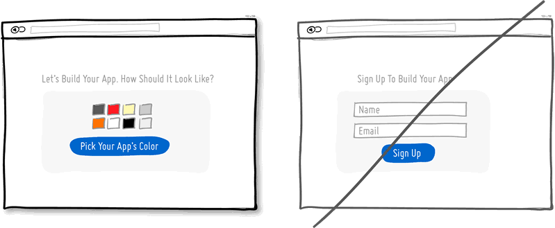

## 23. 減少邊框避免浪費注意力
過程邊框會喧賓奪主。不用說，邊框確實在劃分區域進行版塊設置時有很大的作用，但同時其明顯的線條也會吸引走用戶的注意力。為了達到劃分版塊又不轉移用戶注意力的目的，在排版時可以將界面上不同區域的元素通過空白進行分組，用上不同的背景色，將文字對齊方式進行統一，還有就是為不同區域設置不同的樣式。

當使用所見即所得的界面設計工具時，我們經常在界面上方便地拖出很多區塊來，這些區塊多了就會顯得雜亂無章，所以我們又會到處放些橫線來分界。一個更好的做法是將區塊垂直對齊，這樣做不會讓那些多餘的線條來擾亂視覺。

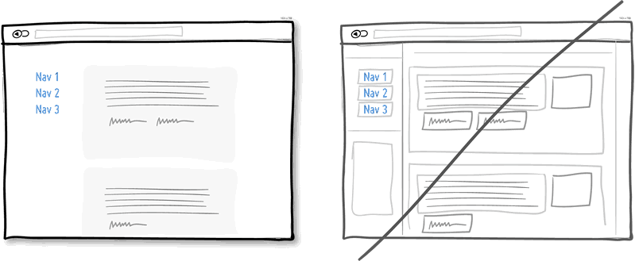

## 24. 展示產品帶來的好處而不要羅列產品特性
市場就是這樣的，用戶永遠只關心自身利益而產品特性對他們來說倒不是那麼重要。只有利益才更直觀地體現出使用產品所帶來的價值。

Chris Guillebeau 在他的著作《100 美元起家》中指出，相比壓力、衝突、煩心事和未知的未來，人們在乎得更多的是愛、金錢、認同感和自由支配的空閒時間。所以我相信在展示產品特性時回歸到利益上是必要的。

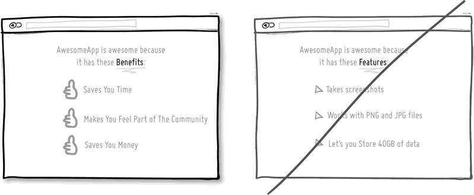

## 25. 要設計好沒有數據時的展現
界面上經常需要呈現不同數量的數據，從 0、1、10、100 到 10000+ 等。這裡存在個普遍的問題就是：在程式最開始使用的 0 條數據到過度到有數據之前，該如何進行顯示界面。這也是我們經常忽視了的地方。

當程式初始沒有數據時，用戶看到的就是一片空白，此時用戶可能不知道該進行哪些操作。利用好沒有數據的初始界面可以讓用戶學習和熟悉如何使用程式，在程式中創建數據。力臻完美永遠是我們追求的目標，界面設計也不例外。

## 26. 嘗試默認選擇
將界面做成默認用戶選中想要使用你的產品，意味著如果用戶真的需要使用，那麼可以直接點擊確定而不需要額外點選了。當然，將界面設計成默認選擇的樣子多少存在點爭議，有點強迫用戶的感覺。

如果你想道德一點，你可以要麼把讓用戶選擇的文字寫得模棱兩可，要麼使用雙重否定這樣不那麼直白的描述，這兩種方式都可以讓用戶覺得沒有那麼強的感覺是被強迫選擇使用產品的。

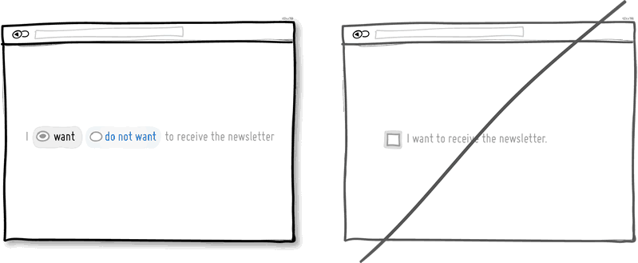

## 27. 保持界面一致性，不要增加用戶的學習成本
自從 Donald Norman 的一系列著作面世後，界面設計中盡量保持一致性成了一個普遍遵循的準則。在設計中保持一致性可以減少用戶的學習成本，用戶不需要學習新的操作。

當我們點擊按鈕或者進行拖拽操作，我們期望這樣的​​操作在整個程式的各個界面都是一致的，會得到相似的結果出來。不過在讓界面變得一致之前，記住一點，適當的打破整體的一致性也是可取的。這偶爾的不一致性的設計用在你需要強調的地方可以起到很大的作用。

所以世事無絕對，我們應遵從一致的設計準則，但適當地打破這種常規。

## 28. 使用合適的默認值，減少用戶的額外操作
適當的默認值和預先填充好的表單字段可以大量減少用戶的工作量。在節省用戶寶貴的時間上面，這是種非常常見的做法，可以幫助用戶快速填完表單或者註冊信息。

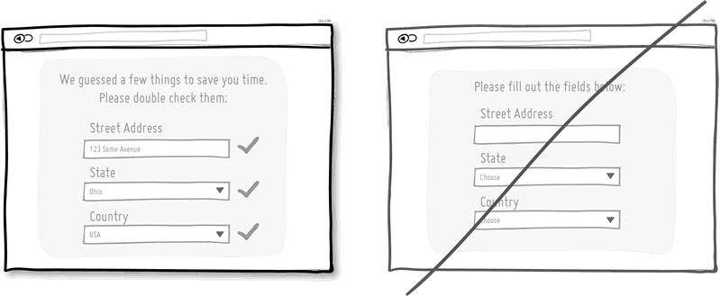

## 29. 遵循慣例避免重複造輪子
界面設計中遵從慣例跟之前的界面一致性準則很相似。如果我們遵從了界面設計中的一些約定，用戶用起來會很方便。相反，不一致和沒有遵從慣例則會提高學習成本。

有了界面設計中這些約定，我們想都不用想就知道界面右上角（大多數情況下）的叉叉是關閉程式用的，或者點擊一個按鈕後我們能夠預測到將會發生什麼。當然，慣例是會過時的，隨著時間的推移，同樣的操作也有可能被賦予新的含義。但要記住，當你在界面中打破這些常規時一定要目的明確，並且出發點是好的。

## 30. 讓用戶覺得可以避免失去而不是獲得
我們喜歡成功，沒有谁愿意失敗。根據心理學得到的可靠結論，人們一般更頃向於避免失去擁有的東西而不是獲得新的利益，這一結論也適用於產品的設計和推廣中。

試著說明你的產品會幫助客戶維護他的利益、保持健康、社會地位等，要好過告訴客戶這個產品會帶來一些他未曾擁有的東西。比如保險公司，它是在銷售我們出事之後可以得到的大筆賠償呢？還是在強調可以幫助我們避免失去擁有的財產？

## 31. 具有層次的圖形化展示優於直白的文字描述
具有層次的設計可以將界面上重要的部分與不次要部分區分開來。要讓界面層次分明，可以在這些方面做文章：對齊方式、間距、顏色、縮進、字體大小、元素尺寸等。當所有這些調整運用得適當時，可以提高整個界面的可讀性。

相比在一個很直白的界面上用戶一眼就可以從上瞟到底的設計，這樣分明的設計也可以讓用戶放慢速度來慢慢閱讀，這樣也使界面更有特色一些。就好比一次旅行，你可以乘坐高鐵快速到達景區（從頁面頂部瞟到底部），但你也可以慢行以欣賞沿途風光。所以層次分明的設計讓眼睛有可以停留的地方，而不是對著空白單調的一個螢幕。

## 32. 將有關聯的東西分組避免雜亂無章
將各個功能項分組合併起來可以提高可用性。有點常識的人都知道刀子和叉子，或者打開文件和關閉文件是放在一起的。將功能相近的元素放在一起也符合邏輯，符合我們平時的認知。

## 33. 使用行內即時校驗而不是提交後再告訴出錯
在處理表單時，最好立即檢測出用戶所填寫內容是否符合要求然後給出驗證消息。這樣錯誤一出現能就能得到改正。相反，提交後再檢查表單會給出錯誤消息，會讓用戶感到不爽又要重複之前的工作。

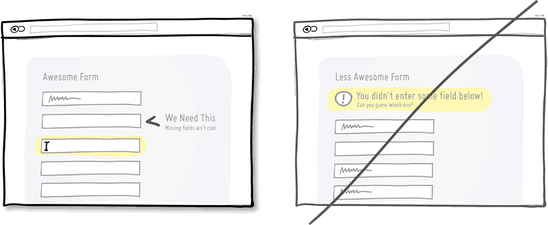

## 34. 放寬對用戶輸入的要求
對用戶輸入的數據，盡量放寬限制，包括格式、大小寫什麼的。這樣做可以更人性化一點，也使得界面更加友好。

一個再恰當不過的例子就是讓用戶輸入電話號碼的時候，用戶有很多種輸入方式，帶括號的、帶破折號的、帶空格的、帶區號和不帶區號的等等。如果你在程式碼中來處理這些格式的問題，代價也只是你一個人多寫幾行程式碼而以，卻可以減少無數用戶的工作量。

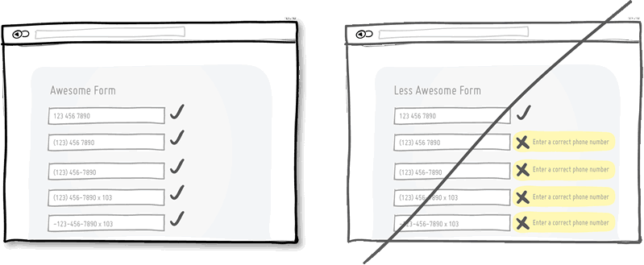

## 35. 讓用戶感覺需要快速做出響應而不是毫無時間觀念
適當的緊迫感是個有效的戰術可以讓用戶立即做出決定，而不是等上個十天半個月。重要的是這種戰術屢試不爽，因為它暗示了資源的緊缺或者活動的時間有限，今天可以買，但明天可能就無法這麼低價了。

另一方面，這一戰術也讓用戶感到會錯失一次大好的機會，再一次，應用了人們害怕失去的本性。當然，這種戰術會被一些人嗤之以鼻，認為是不耿直的做法。不過，這只是種戰術而以，並且在保持合法性的前提下應用也無傷大雅。所以請不要為了營銷而在界面上製造緊迫的假象。

## 36. 嘗試飢餓營銷（製造稀缺感）
物以稀為貴。飢餓營銷給出的信息就是東西不多、只剩幾件、明天再來，可能沒了。你去比較一下批發與限量版的東西他們的價格差距有多大就知道了。

回過頭來看，那些批發商或者大零售商，他們也使用飢餓營銷以獲得更好的銷量。但在軟體行業，我們經常會忘記有飢餓營銷這回事。因為數位產品是可以很容易拷貝複制的，不存在缺貨的情況。

其實，在界面設計中，也可以將其運用起來與現實中的資源緊缺進行聯繫。想想一次網上研討會的門票，想想你一個月可以服務的人數限制，這些信息都可以告知用戶是有限的。

## 37. 讓用戶從已知裡選擇而不是直接回想
這一界面設計中的經典準則是有心理學依據的，相比要讓某人回想想某樣東西，從一堆東西中認出某樣東西會更容易些。

辨識出一樣東西只需要我們稍微回憶一下，通過一些線索就可以完成。而回想則需要我們全面搜索自己的大腦。也許這也是為什麼試卷上選擇題會比簡答題做得快的原因。所以試著在界面上展示一些用戶之前涉及到的信息讓他們進行選擇，而不是讓他們想半天然後自己填寫。

## 38. 讓點擊區域更大
像鏈接、表單的輸入框還有按鈕等，如果尺寸做得大一點則點擊起來更方便容易些。根據費特定律，使用像滑鼠這樣的外設來點擊需要一些時間，特別是元素比較小的情況下時間會更多。鑑於此，最好還是把你的表單輸入框、按鈕等做大點。抑或者你可以保持原有的設計不變，只是把元素可點擊區域（也就是熱區）增大。這樣的一個典型例子是手機設備上的文本鏈接和導航菜單，它們文字不一定很大但背景是拉伸的，在很寬範圍內點擊都有效。

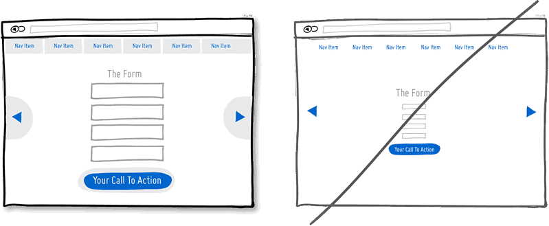

## 39. 優化頁面加載速度，不要讓用戶等太久
速度很重要，頁面加載速度和 UI 對操作的響應速度都直接關係到用戶是否有耐心繼續等下去。無疑地每多一秒种的等待都會失去一些用戶或者機會；一個好的解決之道當然就是優化你的頁面和圖片，除此之外還可以運用心理學讓這個等待時間顯得不那麼長。

具體來說有兩種技巧。一是顯示進度條，二是展示其他相關或有趣的東西來吸引用戶的注意力（就好比你沿著傳送帶走走總比傻站在原地盯著一個位置看要好得多吧）。

## 40. 除了按扭外，建議增加快捷鍵支持
當你的程式廣為流傳，應該考慮下高級用戶的感受。人們總是試圖為一些重複性的操作找到更快捷的方法，快捷鍵就應運而生了。相比在界面上點來點去，快捷鍵無疑大大提高工作效率。

一個好的例子就是現今流行於各個主流程序中的 J（後退）K（前進）快捷鍵組合，比如在 Gmail、Twitter 和 Tumblr 中。按鈕固然好，但快捷鍵會錦上添花。

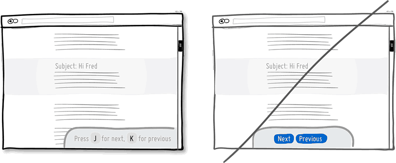

## 41. 嘗試錨定價格
就像卡尼曼觀察到的那樣，錨定效應造成的認知偏差是人類很難克服的，我們的決策受最先進入我們大腦的數字的影響，錨定數量也並不一定是一個價格，它可以是一個數。營銷人員利用錨定效應最常見的例子是同時顯示建議零售價和實際價格。

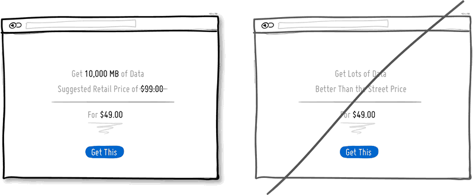

## 42. 讓進度條預設已經走了一部分
一件事越接近完成我們的動力越強，這被稱為目標梯度效應。讓人覺得自己已經取得了進展這件事宜早不宜晚。

## 43. 使用漸進顯示而不是全部展開
漸進顯示不讓大量無關的信息直接暴露出來，而且展現的內容有上下文的關聯，更容易讓用戶理解，不會一下展現太多表單把用戶嚇跑。

## 44. 用小的承諾代替大的
使用承諾是一個功能強大的說服策略，充分挖掘人的自我認知一致性原則，一連竄的小問題答案的「是」，會得到更大問題的「是的」。還有顯示月費而不是年費會傳達出一種沒有合約的感覺，讓用戶覺得隨時可以退出，沒有障礙。

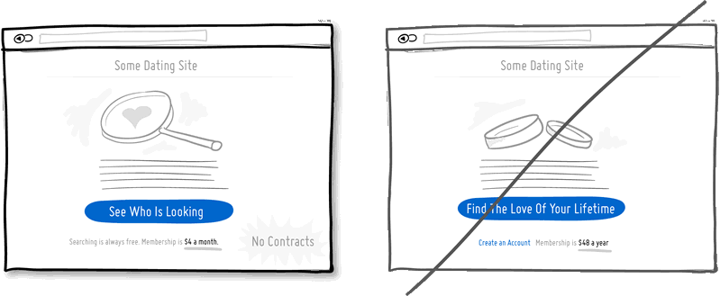

## 45. 替換模態對話框為更溫柔的提示方式
雖然模態對話框更吸引用戶注意力，但是也會帶來一些其他問題，首先阻止了用戶操作對話框之外的操作，而且打斷了用戶之前的操作動作。為什麼不嘗試行內或滑出等不那麼礙眼的提示方式呢？

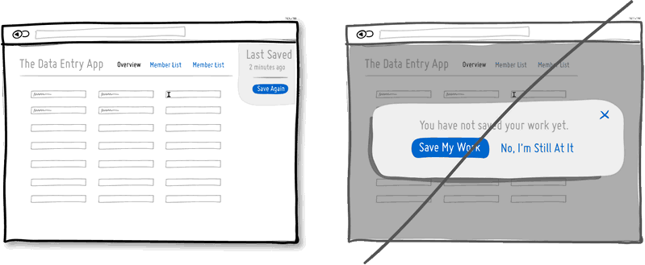

## 46.​​ 嘗試多功能而不是分成很多功能塊
例如可以在輸入框裡實現篩選過濾的功能，而不用增加額外的篩選菜單。打分功能裡增加懸停顯示功能而不是增加額外的顯示模塊。但是不要濫用，否則會增加用戶的學習曲線難度。

## 47. 嘗試增加圖標文本
圖標和文字在一起可以減少很多歧義，比如以下下箭頭到底是表示往下移？降低優先級還是下載呢？或者「X」圖標代表刪除？禁止還是關閉呢？

當用戶沒有時間理解你界面圖標表達的意思的時候問題就麻煩了，所以為了理解，最好圖標要配上文本，如果空間實在不夠，可以用懸停圖標顯示提示文本的方式展現。

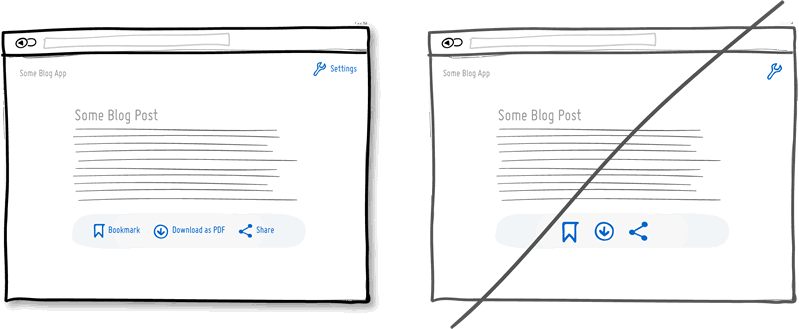

## 48. 嘗試使用更自然的語言代替乾癟的文本
自然語言比簡短、嚴格的短語更方便用戶理解。

## 49. 激發用戶的好奇心
提供一個能激發用戶好奇心的信息，這可能是一個樣章、演示、試用，或做了 XYZ 才能看得到的免費內容。

## 50. 嘗試消除用戶顧慮而不是假設一切正常
告訴你的客戶支付是安全的、貨物免運費而且隨時可以退換，沒有任何後顧之憂，這是能提高轉化率的極佳策略。

## 51. 嘗試價格錯覺
改變提示方式讓人們完全靠自己判斷你的產品的價值，也可以幫助他們做。如果你決定利用人類不理性，就可以用不同價格的顯示方式，讓你的產品變得視為更有價值。比如在價格前加上「只」、「實惠」等詞。把價格分解為每單位價格（例如：每天 1 塊錢，而不是一月 30 塊會員費）另外，可以使用以 9 結尾的數來減少價格位數。

## 52. 嘗試感謝你的用戶而不是簡單的完成確認
透過表達對用戶的欣賞和關心等感謝用語，可以讓你的業務、產品或 UI 更加人性化。感謝可以引導出進一步的對話或行動。

感謝您閱讀這一段。:)

## 53. 直接給出有意義的結果不要讓用戶做數字轉換工作
比如顯示 3 分鐘前就比顯示一個時間日期更容易理解，讓用戶免除一切數學計算。

## 54. 給予用戶再次確認選擇的自由
在行動按鈕或選擇之後告訴用戶有自我選擇或拒絕的自由。

## 55. 讓獎勵變得隨機
可變的隨機的獎勵會讓用戶上癮（遊戲讓人上癮的原理之一）。

## 56. 抓住用戶的注意力
可以用增加尺寸和提高對比度的方式來突出重要行動。其他吸引注意力的方法有：採用不規則形狀、自動焦點、、固定跟隨（浮動）以及方向箭頭等。

## 57. 讓表格對比清晰明確
表格應該顯示出最相關的屬性差異，有助於用戶做出單個決定。

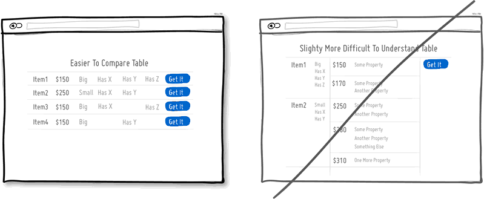

## 58. 顯示一組而不是單獨的一項
人有收集東西的癖好，無論是物理的還是虛擬的。收集一整套東西會自然的成為奮鬥目標。通常獲得一整套東西帶來的收益增加（蛋糕比其單獨的成分更大、更好）。通過顯示過去的收穫也會增強以後的行為動機。

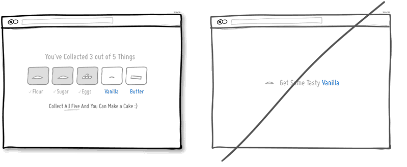

## 59. 讓用戶有明晰的期望而不是蒙在鼓裡
你在 X 步驟中的第一步；你的選擇結果在 Y 中；在 Z 之前你會收到 XX，下一個任務將全部完成。這種不斷的清晰的提示可以建立與用戶之間的信任，而不是讓用戶兩眼摸黑。

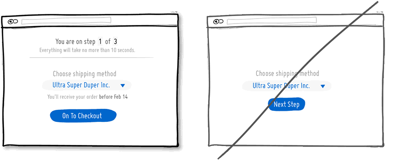

## 60. 用幽默代替嚴肅
為什麼要一直那麼嚴肅呢？在你的 UI 裡加入一些幽默的元素有助於與你的用戶 / 客戶之間建立良好的情感聯繫，也更容易原諒你的一些錯誤。

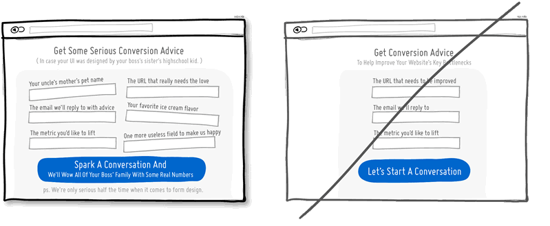

## 61. 用反饋代替沉默
當我們執行了一個動作，肯定我們希望知道是否成功。比如：當我們發送郵件時候希望知道是否發送成功。什麼反饋也沒有意味著不確定性：起作用了麼？點擊了麼？按鈕按下去了麼？是否要重試？成功提醒是非常有價值的交互。

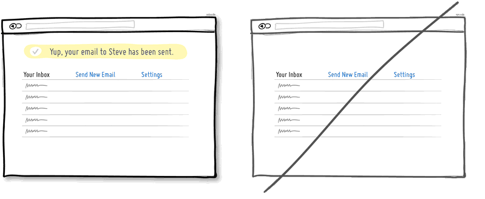

## 62. 判斷出用戶意圖
如下圖所示，這是亞馬遜的一個多級菜單，當第一個菜單展開，用戶滑鼠往右下角移動路過第二個菜單的時候，之前的展開的菜單並不會消失，他們靠算法預判到用戶可能是想點擊第一個菜單下的某個子菜單。

## 63. 使用寬鬆的間隔避免元素擠在一起
空白的填充可以讓內容和表格的可讀性更好，廣泛適用於列表、表格、段落等元素。

## 64. 使用講故事的方式而不是列出事實
講故事是最古老的傳播方式，可以在著頁面和各種 UI 交互頁使用。一個基本的故事有幾個簡單的元素，如場景、帶著目的的人物、遇到的問題。故事可以引發讀者的情感反應，就像自己遇到了同樣的處境。這樣，故事也可變得更加難忘。這也就是為什麼銷售長久以來喜歡講故事，說明這非常有效的。

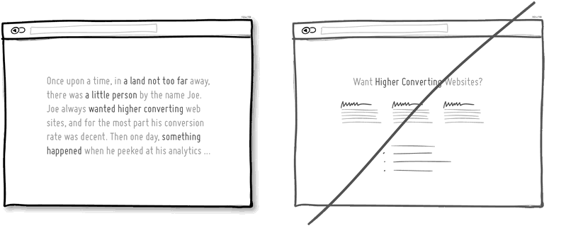

## 65. 使用可靠的內容，避免造假
人們可以一眼就看出太假的東西，為了讓你的產品更值得信賴， 不要造假。股票高高的走勢圖和網頁上開心笑的人沒有任何理由和意義。混雜著好和壞的評價，非整數數字讓你的網頁更真實可靠。

## 66. 隨著用戶的進階而優化
當用戶對你的操作界面很熟悉之後，一些給新手顯示的東西或者一些經常顯示的東西變得不那麼重要，可以去掉或者移動其他地方。這樣可以讓設計更加精簡。

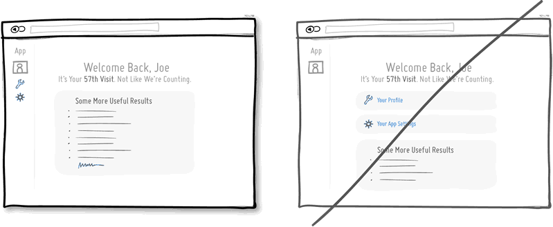

## 67. 以別人為中心
想建立社會影響力的時候就要優先考慮別人的利益，把對話中的「我」變成「你」。

## 68. 對於你顯而易見的東西可能對於別人不是
有些事情對於我們來說似乎是顯而易見的，對於別人卻不是。如下圖中讓用戶輸入 URL 快捷方式，用戶不一定知道指的是什麼：

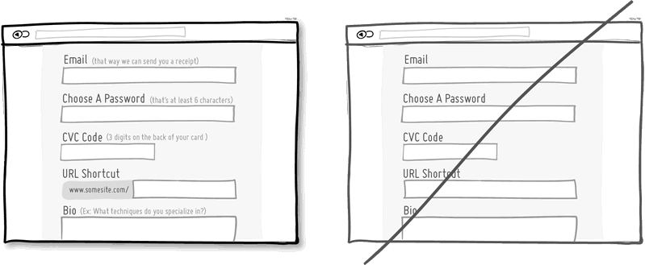

## 69. 讓語言簡潔明了，去掉多餘的廢話
使用更少、更簡潔的話，在寫完草稿後，看看是否還可以縮減。抓住要點可以避免丟掉用戶的注意力。

## 70. 使用響應式佈局避免靜態佈局
沒有什麼比出現橫縱雙滾動條更糟糕的頁面了！讓頁面支持響應式佈局，這樣在各種大小的移動設備上都能良好的顯示。

## 71. 讓視覺效果清晰明確
讓不同的元素成組，使用不同的字號、使用不同的色調，讓視覺效果清晰明確。

## 72. 讓你的界面可糾錯
出錯是難免的，所以用戶界面應該允許細微的糾正。如更換帳號或更換地址等

## 73. 讓用戶嘗試社會承諾
人類偏愛一致的自我形象，社會承諾會成為一種自我動機。在這一點上「公開的社會承諾」，會讓人更有責任去兌現。當我們告訴人們，我們會做一些事情（或者採取公開的行動），那麼未來行動的可能性就會更高。

## 74. 增加重試和重做的功能
例如：當上傳圖片時候，文件上傳失敗或者對上傳的圖片不滿意想換一張的時候，重試和重做就很有必要。

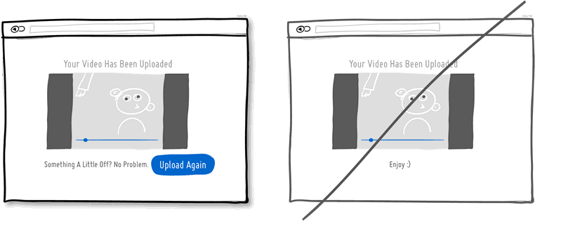

## 75. 把過多的選擇去掉
更多的選擇讓決策越難，甚至還會降低滿意度，因為這讓後悔和自責傾向增加。著名的果醬研究實驗一次次的被驗證。

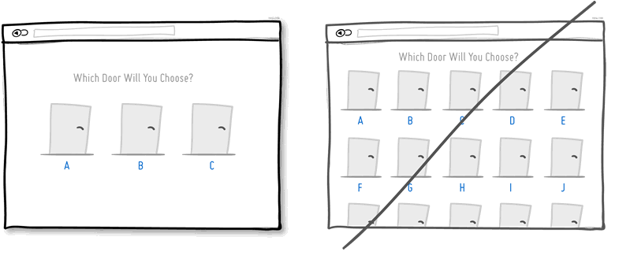
